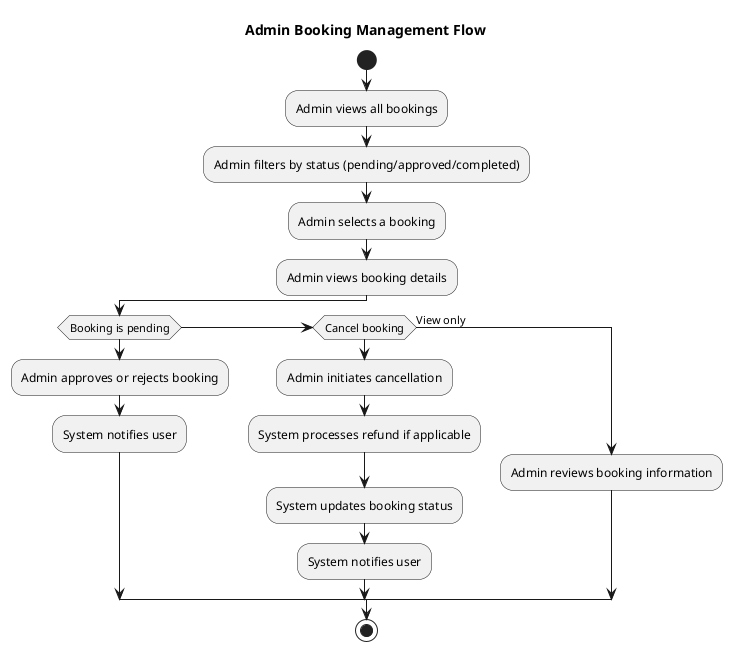

# PlantUML Activity Diagram: Admin Booking Management

```plantuml
@startuml
title Admin Booking Management Flow

start
:Admin views all bookings;
:Admin filters by status (pending/approved/completed);
:Admin selects a booking;
:Admin views booking details;
if (Booking is pending) then
  :Admin approves or rejects booking;
  :System notifies user;
elseif (Cancel booking) then
  :Admin initiates cancellation;
  :System processes refund if applicable;
  :System updates booking status;
  :System notifies user;
else (View only)
  :Admin reviews booking information;
endif
stop
@enduml
```