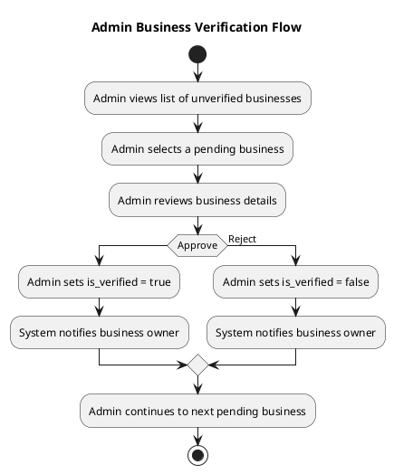

# PlantUML Activity Diagram: Admin Business Verification

```plantuml
@startuml
title Admin Business Verification Flow

start
:Admin views list of unverified businesses;
:Admin selects a pending business;
:Admin reviews business details;
if (Approve) then
  :Admin sets is_verified = true;
  :System notifies business owner;
else (Reject)
  :Admin sets is_verified = false;
  :System notifies business owner;
endif
:Admin continues to next pending business;
stop
@enduml
```