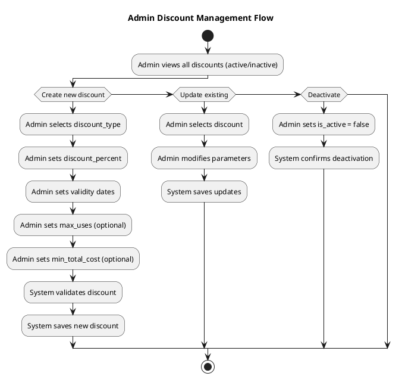

# PlantUML Activity Diagram: Admin Discount Management

```plantuml
@startuml
title Admin Discount Management Flow

start
:Admin views all discounts (active/inactive);
if (Create new discount) then
  :Admin selects discount_type;
  :Admin sets discount_percent;
  :Admin sets validity dates;
  :Admin sets max_uses (optional);
  :Admin sets min_total_cost (optional);
  :System validates discount;
  :System saves new discount;
elseif (Update existing)then
  :Admin selects discount;
  :Admin modifies parameters;
  :System saves updates;
elseif (Deactivate) then
  :Admin sets is_active = false;
  :System confirms deactivation;
endif
stop
@enduml
```