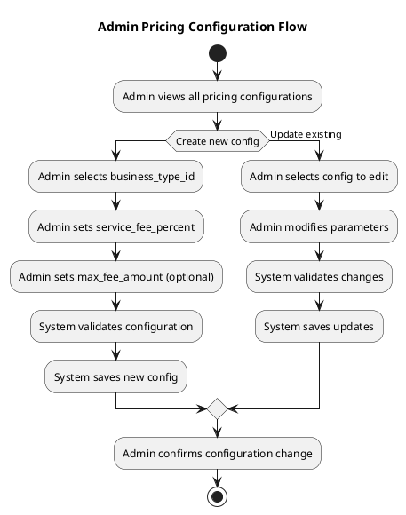

# PlantUML Activity Diagram: Admin Pricing Configuration

```plantuml
@startuml
title Admin Pricing Configuration Flow

start
:Admin views all pricing configurations;
if (Create new config) then
  :Admin selects business_type_id;
  :Admin sets service_fee_percent;
  :Admin sets max_fee_amount (optional);
  :System validates configuration;
  :System saves new config;
else (Update existing)
  :Admin selects config to edit;
  :Admin modifies parameters;
  :System validates changes;
  :System saves updates;
endif
:Admin confirms configuration change;
stop
@enduml
```