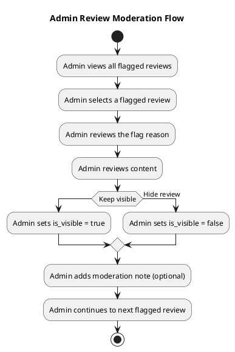

# PlantUML Activity Diagram: Admin Review Moderation

```plantuml
@startuml
title Admin Review Moderation Flow

start
:Admin views all flagged reviews;
:Admin selects a flagged review;
:Admin reviews the flag reason;
:Admin reviews content;
if (Keep visible) then
  :Admin sets is_visible = true;
else (Hide review)
  :Admin sets is_visible = false;
endif
:Admin adds moderation note (optional);
:Admin continues to next flagged review;
stop
@enduml
```