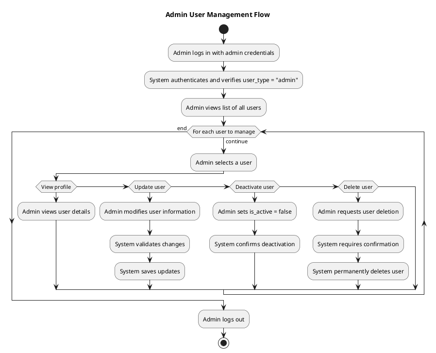

# PlantUML Activity Diagram: Admin User Management

```plantuml
@startuml
title Admin User Management Flow

start
:Admin logs in with admin credentials;
:System authenticates and verifies user_type = "admin";
:Admin views list of all users;
while (For each user to manage) is (continue)
  :Admin selects a user;
  if (View profile) then
    :Admin views user details;
  elseif (Update user) then
    :Admin modifies user information;
    :System validates changes;
    :System saves updates;
  elseif (Deactivate user) then
    :Admin sets is_active = false;
    :System confirms deactivation;
  elseif (Delete user) then
    :Admin requests user deletion;
    :System requires confirmation;
    :System permanently deletes user;
  endif
endwhile (end)
:Admin logs out;
stop
@enduml
```