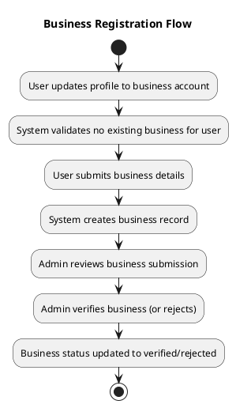

# PlantUML Activity Diagram: Business Registration

```plantuml
@startuml
title Business Registration Flow

start
:User updates profile to business account;
:System validates no existing business for user;
:User submits business details;
:System creates business record;
:Admin reviews business submission;
:Admin verifies business (or rejects);
:Business status updated to verified/rejected;
stop
@enduml
```