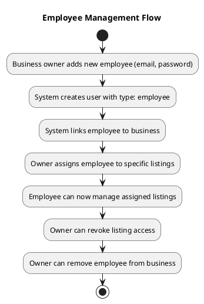

# PlantUML Activity Diagram: Employee Management

```plantuml
@startuml
title Employee Management Flow

start
:Business owner adds new employee (email, password);
:System creates user with type: employee;
:System links employee to business;
:Owner assigns employee to specific listings;
:Employee can now manage assigned listings;
:Owner can revoke listing access;
:Owner can remove employee from business;
stop
@enduml
```