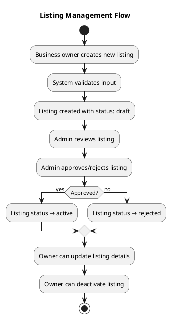

# PlantUML Activity Diagram: Listing Management

```plantuml
@startuml
title Listing Management Flow

start
:Business owner creates new listing;
:System validates input;
:Listing created with status: draft;
:Admin reviews listing;
:Admin approves/rejects listing;
if (Approved?) then (yes)
  :Listing status → active;
else (no)
  :Listing status → rejected;
endif
:Owner can update listing details;
:Owner can deactivate listing;
stop
@enduml
```