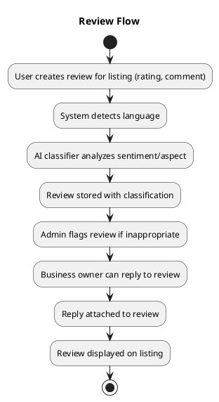

# PlantUML Activity Diagram: Review Flow

```plantuml
@startuml
title Review Flow

start
:User creates review for listing (rating, comment);
:System detects language;
:AI classifier analyzes sentiment/aspect;
:Review stored with classification;
:Admin flags review if inappropriate;
:Business owner can reply to review;
:Reply attached to review;
:Review displayed on listing;
stop
@enduml
```