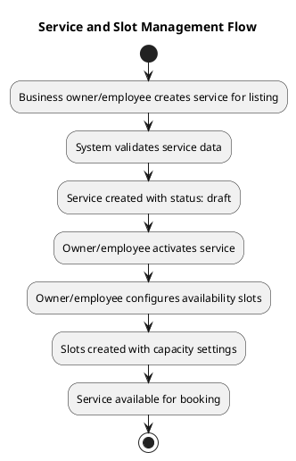

# PlantUML Activity Diagram: Service and Slot Management

```plantuml
@startuml
title Service and Slot Management Flow

start
:Business owner/employee creates service for listing;
:System validates service data;
:Service created with status: draft;
:Owner/employee activates service;
:Owner/employee configures availability slots;
:Slots created with capacity settings;
:Service available for booking;
stop
@enduml
```