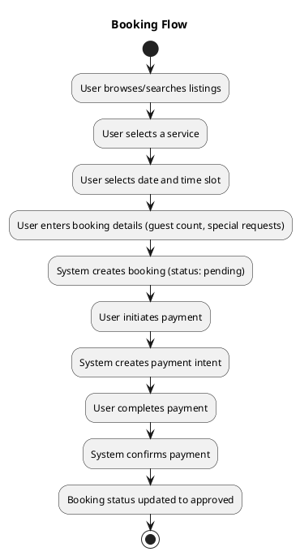

# PlantUML Activity Diagram: Booking Flow

```plantuml
@startuml
title Booking Flow

start
:User browses/searches listings;
:User selects a service;
:User selects date and time slot;
:User enters booking details (guest count, special requests);
:System creates booking (status: pending);
:User initiates payment;
:System creates payment intent;
:User completes payment;
:System confirms payment;
:Booking status updated to approved;
stop
@enduml
```