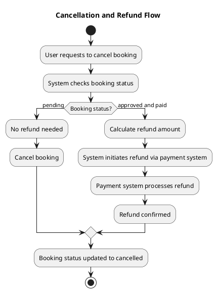

# PlantUML Activity Diagram: Cancellation and Refund

```plantuml
@startuml
title Cancellation and Refund Flow

start
:User requests to cancel booking;
:System checks booking status;
if (Booking status?) then (pending)
  :No refund needed;
  :Cancel booking;
else (approved and paid)
  :Calculate refund amount;
  :System initiates refund via payment system;
  :Payment system processes refund;
  :Refund confirmed;
endif
:Booking status updated to cancelled;
stop
@enduml
```