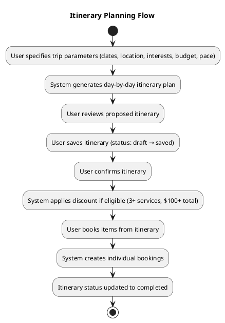

# PlantUML Activity Diagram: Itinerary Planning

```plantuml
@startuml
title Itinerary Planning Flow

start
:User specifies trip parameters (dates, location, interests, budget, pace);
:System generates day-by-day itinerary plan;
:User reviews proposed itinerary;
:User saves itinerary (status: draft → saved);
:User confirms itinerary;
:System applies discount if eligible (3+ services, $100+ total);
:User books items from itinerary;
:System creates individual bookings;
:Itinerary status updated to completed;
stop
@enduml
```