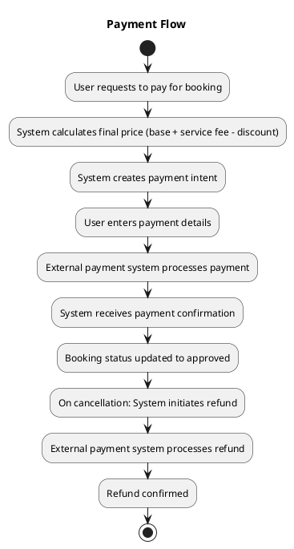

# PlantUML Activity Diagram: Payment Flow

```plantuml
@startuml
title Payment Flow

start
:User requests to pay for booking;
:System calculates final price (base + service fee - discount);
:System creates payment intent;
:User enters payment details;
:External payment system processes payment;
:System receives payment confirmation;
:Booking status updated to approved;
:On cancellation: System initiates refund;
:External payment system processes refund;
:Refund confirmed;
stop
@enduml
```