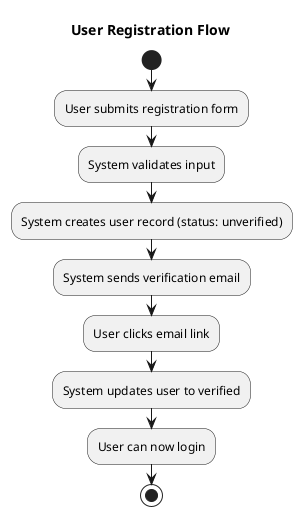

# PlantUML Activity Diagram: User Registration

```plantuml
@startuml
title User Registration Flow

start
:User submits registration form;
:System validates input;
:System creates user record (status: unverified);
:System sends verification email;
:User clicks email link;
:System updates user to verified;
:User can now login;
stop
@enduml
```