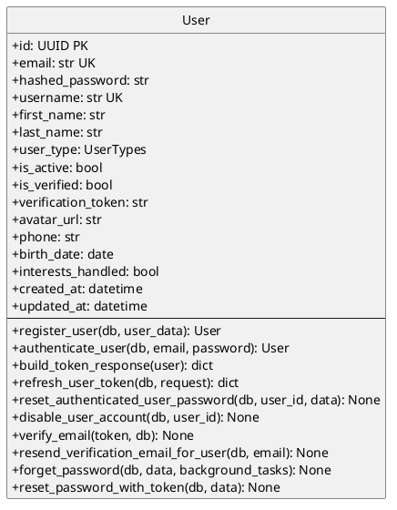

# Auth Module - Class Diagram with Operations (PlantUML)

## Auth Module - Models with Operations

This diagram shows the Auth module models and their operations.

| Model | Source Module | Relationship |
|-------|--------------|--------------|
| **User** | users | Core user entity - Auth module authenticates users |

## Cross-Module Connections

The Auth module connects to the **users** module through:
- User model: Authentication validates against User credentials

## Key Model Attributes

### User
- `id: UUID` - Primary key
- `email: str` - Unique email for login
- `hashed_password: str` - Stored password hash
- `username: str` - Unique username
- `is_verified: bool` - Email verification status
- `verification_token: str` - Token for email verification
- `user_type: UserTypes` - Enum: regular, business, admin, employee
