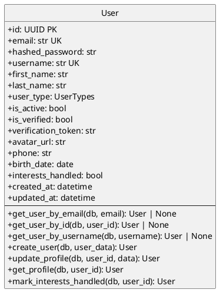

# Users Module - Class Diagram (PlantUML)

## Users Module - Models Only

This diagram shows only the models within the Users module.

| Model | Description |
|-------|-------------|
| **User** | Core user entity with authentication data |

## Cross-Module Connections

The Users module connects to other modules through the **User** model:

| Connected Module | Via Model | Relationship |
|-----------------|-----------|--------------|
| **auth** | User | Auth module authenticates users |
| **bookings** | User | User books services (user_id FK in Booking) |
| **reviews** | User | User writes reviews (user_id FK in Review) |
| **favourites** | User | User saves favourites (user_id FK in Favourites) |
| **itineraries** | User | User creates itineraries (user_id FK in Itinerary) |
| **businesses** | User | User owns businesses (user_id FK in Business) |

## Key Model Attributes

### User
- `id: UUID` - Primary key
- `email: str` - Unique email for login
- `username: str` - Unique username
- `hashed_password: str` - Stored password hash
- `user_type: UserTypes` - Enum: regular, business, admin, employee
- `is_verified: bool` - Email verification status
