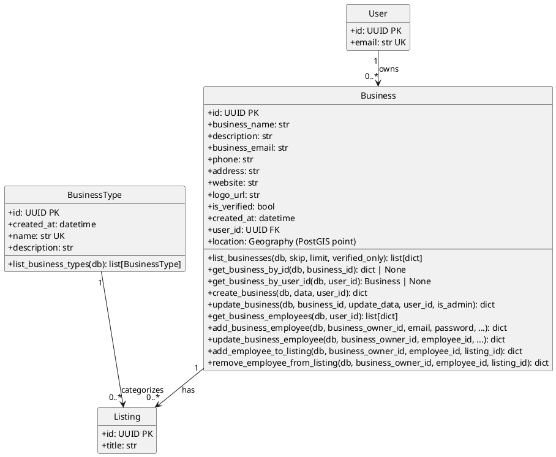

# Businesses Module - Class Diagram with Operations (PlantUML)

## Businesses Module - Models with Operations

This diagram shows the Businesses module models and their operations.

| Model | Description |
|-------|-------------|
| **Business** | Business entity owned by a user |
| **BusinessType** | Category/type for businesses and listings |

## Cross-Module Connections

The Businesses module connects to other modules through its models:

| Connected Module | Via Model | Relationship |
|-----------------|-----------|--------------|
| **users** | Business | User owns Business (user_id FK in Business) |
| **listings** | Business, Listing | Business has many Listings (business_id FK in Listing) |
| **listings** | BusinessType, Listing | BusinessType categorizes Listings (business_type FK in Listing) |
| **reviews** | Business, BusinessReply | Business can respond to reviews via BusinessReply |

## Key Model Attributes

### Business
- `id: UUID` - Primary key
- `business_name: str` - Name of the business
- `user_id: UUID` - Foreign key to User (owner)
- `is_verified: bool` - Verification status
- `location: Geography` - Geographic location (PostGIS)

### BusinessType
- `id: UUID` - Primary key
- `name: str` - Unique business type name (e.g., "hotel", "restaurant", "tour")
- `description: str` - Type description
