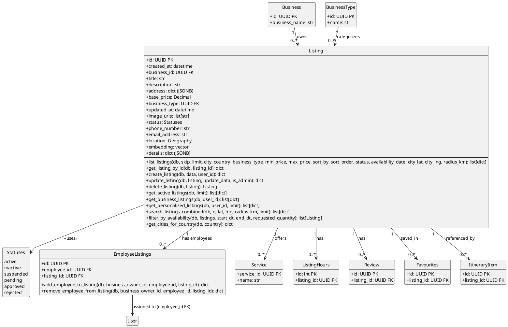

# Listings Module - Class Diagram with Operations (PlantUML)

## Listings Module - Models with Operations

This diagram shows the Listings module models and their operations.

| Model | Description |
|-------|-------------|
| **Listing** | Travel experience/service listing |
| **Statuses** | Enum for listing status states |
| **EmployeeListings** | Junction table for employee-listing assignment |

## Cross-Module Connections

The Listings module is a central hub connecting many modules:

| Connected Module | Via Model | Relationship |
|-----------------|-----------|--------------|
| **businesses** | Business | Business owns Listing (business_id FK) |
| **businesses** | BusinessType | BusinessType categorizes Listing (business_type FK) |
| **users** | User | Employees assigned via EmployeeListings |
| **services** | Service | Listing offers Services (1-to-many) |
| **availability** | ListingHours | Listing has operating hours (1-to-many) |
| **reviews** | Review | Listing has Reviews (1-to-many) |
| **favourites** | Favourites | Listing can be saved in Favourites (1-to-many) |
| **itineraries** | ItineraryItem | ItineraryItem references Listing (1-to-many) |

## Key Model Attributes

### Listing
- `id: UUID` - Primary key
- `business_id: UUID` - Foreign key to Business (owner)
- `business_type: UUID` - Foreign key to BusinessType (category)
- `title: str` - Listing title
- `base_price: Decimal` - Base price for the listing
- `status: Statuses` - Current status enum
- `location: Geography` - PostGIS geography point
- `embedding: vector` - For similarity search

### EmployeeListings
- `employee_id: UUID` - Foreign key to User
- `listing_id: UUID` - Foreign key to Listing
