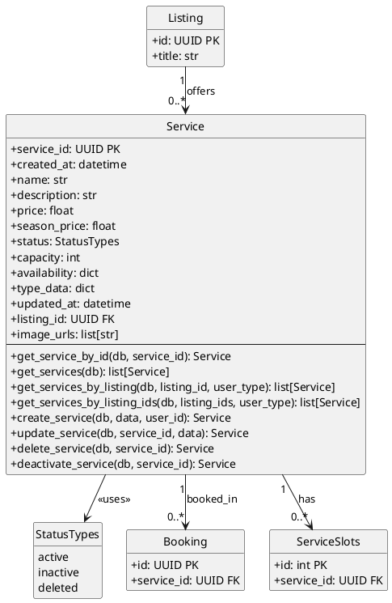

# Services Module - Class Diagram (PlantUML)

## Services Module - Models Only

This diagram shows only the models within the Services module and how it connects to other modules via models.

| Model | Description |
|-------|-------------|
| **Service** | Bookable service offered by a listing |
| **StatusTypes** | Enum for service status states |

**Note:** ServiceSlots is in the **availability** module, not services module.

## Cross-Module Connections

The Services module connects to other modules:

| Connected Module | Via Model | Relationship |
|-----------------|-----------|--------------|
| **listings** | Listing | Service belongs to Listing (listing_id FK) |
| **availability** | ServiceSlots | ServiceSlots belongs to Service (service_id FK) |
| **bookings** | Booking | Service is booked via Booking (service_id FK) |

## Key Model Attributes

### Service
- `service_id: UUID` - Primary key
- `listing_id: UUID` - Foreign key to Listing (parent)
- `name: str` - Service name
- `price: float` - Base price
- `season_price: float` - Seasonal pricing
- `capacity: int` - Maximum capacity
- `status: StatusTypes` - Current status enum
- `image_urls: list[str]` - Service images
