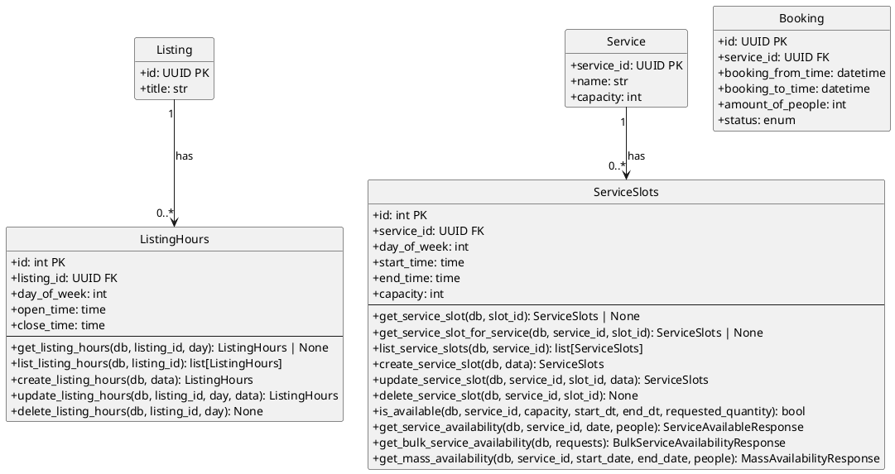

# Availability Module - Class Diagram (PlantUML)



## Availability Module - Models Only

This diagram shows only the models within the Availability module and how it connects to other modules via models.

| Model | Description |
|-------|-------------|
| **ListingHours** | Operating hours for listings |
| **ServiceSlots** | Availability time slots for services |

## Internal Relationships

| Relationship | Description |
|--------------|-------------|
| Service → ServiceSlots | Service has multiple time slots (1-to-many) |
| Listing → ListingHours | Listing has operating hours per day of week (1-to-many) |

## Cross-Module Connections

The Availability module connects to other modules:

| Connected Module | Via Model | Relationship |
|-----------------|-----------|--------------|
| **listings** | Listing, ListingHours | ListingHours belongs to Listing (listing_id FK) |
| **services** | Service, ServiceSlots | ServiceSlots belongs to Service (service_id FK) |
| **bookings** | Booking | Availability checks Booking counts to determine if slot is available |

## Availability Calculations

The Availability module determines if a service slot is available by:
1. Getting the ServiceSlots capacity
2. Counting existing Bookings that overlap with the requested time slot
3. Checking if remaining capacity >= requested quantity

```
Available = ServiceSlots.capacity - Count(Bookings where overlap)
```

## Key Model Attributes

### ListingHours
- `listing_id: UUID` - Foreign key to Listing
- `day_of_week: int` - Day of week (0=Sunday, 6=Saturday)
- `open_time: time` - Opening time
- `close_time: time` - Closing time

### ServiceSlots
- `service_id: UUID` - Foreign key to Service
- `day_of_week: int` - Day of week
- `start_time: time` - Slot start time
- `end_time: time` - Slot end time
- `capacity: int` - Maximum bookings for this slot
