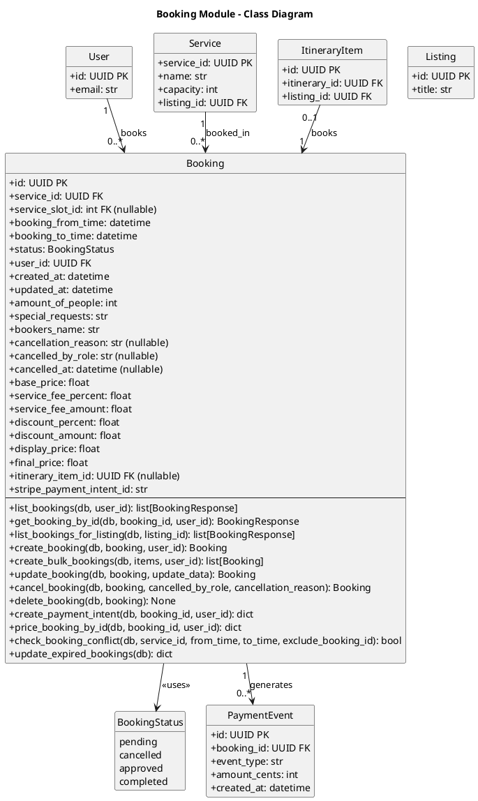

# Bookings Module - Class Diagram (PlantUML)



## Bookings Module - Models Only

This diagram shows only the models within the Bookings module and how it connects to other modules via models.

| Model             | Description                    |
| ----------------- | ------------------------------ |
| **Booking**       | Reservation for a service      |
| **BookingStatus** | Enum for booking status states |

## Internal Relationships

| Relationship            | Description                                        |
| ----------------------- | -------------------------------------------------- |
| Booking → BookingStatus | Booking status is determined by BookingStatus enum |

## Cross-Module Connections

The Bookings module connects to other modules:

| Connected Module   | Via Model     | Relationship                                                       |
| ------------------ | ------------- | ------------------------------------------------------------------ |
| **users**          | User          | User books services (user_id FK in Booking)                        |
| **services**       | Service       | Booking books Service (service_id FK in Booking)                   |
| **listings**       | Listing       | Service belongs to Listing (via Service.listings_id FK)            |
| **itineraries**    | ItineraryItem | ItineraryItem can link to Booking (itinerary_item_id FK, nullable) |
| **stripe_payment** | PaymentEvent  | Booking generates PaymentEvents (booking_id FK)                    |

## Booking Status Flow

```
    [pending]
        |
        +-----> [approved] -----> [completed]
        |              |
        v              v
    [cancelled]   [cancelled]
```

## Key Model Attributes

### Booking

- `id: UUID` - Primary key
- `service_id: UUID` - Foreign key to Service being booked
- `service_slot_id: int` - Foreign key to specific time slot (nullable)
- `user_id: UUID` - Foreign key to User making the booking
- `booking_from_time: datetime` - Start of booking
- `booking_to_time: datetime` - End of booking
- `amount_of_people: int` - Number of people
- `status: BookingStatus` - Current status enum (pending, approved, cancelled, completed)
- `itinerary_item_id: UUID` - Optional link to ItineraryItem (for package discounts)
- `bookers_name: str` - Name of the person booking
- `special_requests: str` - Special requests or notes
- `cancellation_reason: str` - Reason for cancellation (set when cancelled)
- `cancelled_by_role: str` - Who cancelled (user/business/admin)
- `cancelled_at: datetime` - When booking was cancelled
- `base_price: float` - Base price before fees
- `service_fee_percent: float` - Platform fee percentage
- `service_fee_amount: float` - Calculated platform fee
- `discount_percent: float` - Discount percentage applied
- `discount_amount: float` - Discount amount applied
- `display_price: float` - Price shown to user before discount
- `final_price: float` - Final price after fees and discounts
- `stripe_payment_intent_id: str` - Stripe payment intent reference
