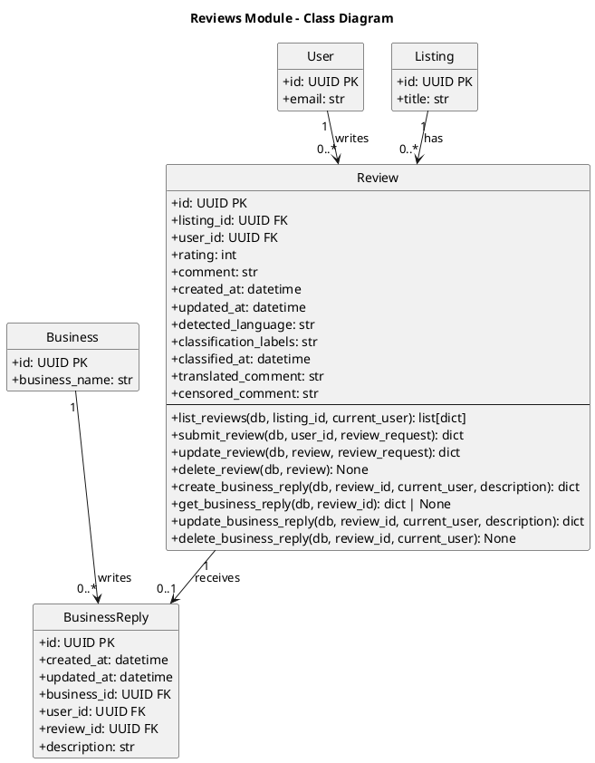

# Reviews Module - Class Diagram (PlantUML)

## Reviews Module - Models Only

This diagram shows only the models within the Reviews module and how it connects to other modules via models.

| Model             | Description                   |
| ----------------- | ----------------------------- |
| **Review**        | User review for a listing     |
| **BusinessReply** | Business response to a review |

## Cross-Module Connections

The Reviews module connects to other modules:

| Connected Module | Via Model               | Relationship                                                         |
| ---------------- | ----------------------- | -------------------------------------------------------------------- |
| **users**        | User                    | User writes reviews (user_id FK in Review)                           |
| **listings**     | Listing                 | Listing has reviews (listing_id FK in Review)                        |
| **businesses**   | Business, BusinessReply | Business writes replies to reviews (business_id FK in BusinessReply) |

## Review Classification

Reviews can be classified using ML-based classification:

- `detected_language: str` - Language detected in comment
- `classification_labels: str` - Labels like "positive", "negative", "neutral"
- `translated_comment: str` - Translated text
- `censored_comment: str` - Profanity censored text

## Key Model Attributes

### Review

- `id: UUID` - Primary key
- `listing_id: UUID` - Foreign key to Listing being reviewed
- `user_id: UUID` - Foreign key to User who wrote the review
- `rating: int` - Rating value (1-5)
- `comment: str` - Review text

### BusinessReply

- `id: UUID` - Primary key
- `review_id: UUID` - Foreign key to Review (unique)
- `business_id: UUID` - Foreign key to Business responding
- `user_id: UUID` - Foreign key to User who wrote reply
- `description: str` - Reply text
