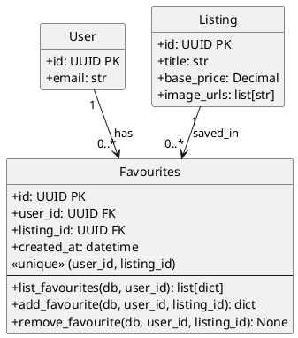

# Favourites Module - Class Diagram with Operations (PlantUML)



## Favourites Module - Models with Operations

This diagram shows the Favourites module models and their operations.

| Model | Description |
|-------|-------------|
| **Favourites** | User's saved listings |

## Internal Relationships

The Favourites module has no internal model relationships - it only has the Favourites model.

## Cross-Module Connections

The Favourites module connects to other modules:

| Connected Module | Via Model | Relationship |
|-----------------|-----------|--------------|
| **users** | User | User saves favourites (user_id FK in Favourites) |
| **listings** | Listing | Listing is saved in favourites (listing_id FK in Favourites) |

## Unique Constraint

```
Favourites table has unique constraint on (user_id, listing_id)

This ensures:
- User can only favourite a listing once
- Adding again returns existing favourite (idempotent)
```

## Key Model Attributes

### Favourites
- `id: UUID` - Primary key
- `user_id: UUID` - Foreign key to User who favourited
- `listing_id: UUID` - Foreign key to Listing that was favourited
- `created_at: datetime` - When the favourite was created
