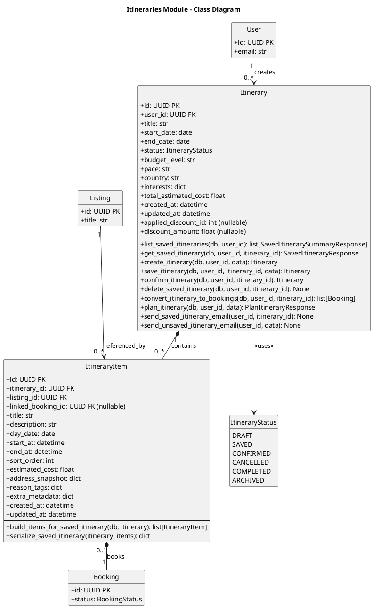

# Itineraries Module - Class Diagram with Operations (PlantUML)



## Itineraries Module - Models with Operations

This diagram shows the Itineraries module models and their operations.

| Model               | Description                             |
| ------------------- | --------------------------------------- |
| **Itinerary**       | User's planned trip                     |
| **ItineraryItem**   | Individual stop/booking in an itinerary |
| **ItineraryStatus** | Enum for itinerary status               |

## Cross-Module Connections

The Itineraries module connects to other modules:

| Connected Module | Via Model | Relationship                                                       |
| ---------------- | --------- | ------------------------------------------------------------------ |
| **users**        | User      | User creates Itineraries (user_id FK)                              |
| **listings**     | Listing   | ItineraryItem references Listing (listing_id FK)                   |
| **bookings**     | Booking   | ItineraryItem can link to Booking (linked_booking_id FK, nullable) |

## Itinerary Lifecycle

```
    [DRAFT] --> [SAVED] --> [CONFIRMED] --> [COMPLETED]
       |           |            |
       v           v            v
    [ARCHIVED] [CANCELLED]  [CANCELLED]
```

## Key Model Attributes

### Itinerary

- `id: UUID` - Primary key
- `user_id: UUID` - Foreign key to User (creator)
- `title: str` - Itinerary title
- `start_date: date` - Trip start date
- `end_date: date` - Trip end date
- `status: ItineraryStatus` - Current status enum (DRAFT, SAVED, CONFIRMED, CANCELLED, COMPLETED, ARCHIVED)
- `budget_level: str` - Budget level
- `pace: str` - Pace preference
- `country: str` - Destination country
- `interests: dict` - User's interests for this trip
- `total_estimated_cost: float` - Running total of estimated costs
- `applied_discount_id: int` - Applied package discount (if any)
- `discount_amount: float` - Amount discounted

### ItineraryItem

- `id: UUID` - Primary key
- `itinerary_id: UUID` - Foreign key to parent Itinerary
- `listing_id: UUID` - Foreign key to referenced Listing
- `linked_booking_id: UUID` - Optional link to Booking (set when item is converted to booking)
- `day_date: date` - Date for this item
- `start_at: datetime` - Start time
- `end_at: datetime` - End time
- `sort_order: int` - Order within the itinerary
- `estimated_cost: float` - Estimated price
- `address_snapshot: dict` - Snapshot of listing address at time of planning
- `reason_tags: dict` - Tags explaining why this item was recommended
- `extra_metadata: dict` - Additional item-specific data
