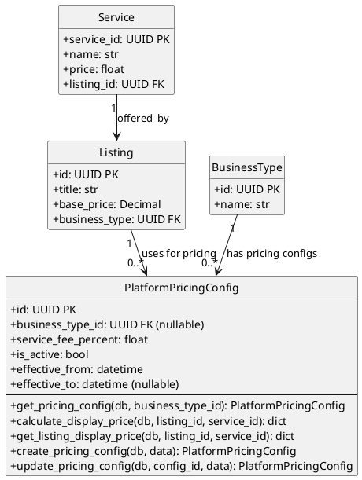

# Pricing Module - Class Diagram (PlantUML)



## Pricing Module - Models with Operations

This diagram shows the Pricing module models and their operations.

| Model | Description |
|-------|-------------|
| **PlatformPricingConfig** | Platform fee configuration per business type |

## Key Operations

### PlatformPricingConfig

| Operation | Description |
|-----------|-------------|
| `get_pricing_config(db, business_type_id)` | Get active pricing config for a business type or global fallback |
| `calculate_display_price(db, listing_id, service_id)` | Calculate display price (base + service fee) |
| `get_listing_display_price(db, listing_id, service_id)` | Get display price for a listing |
| `create_pricing_config(db, data)` | Create new pricing configuration |
| `update_pricing_config(db, config_id, data)` | Update existing configuration |

## Pricing Calculation Formula

```
display_price = base_price + service_fee_amount
service_fee_amount = base_price × service_fee_percent
```

Where `base_price` comes from either:
- `Service.price` (if service_id provided)
- `Listing.base_price` (fallback)

## Cross-Module Connections

| Connected Module | Via Model | Relationship |
|-----------------|-----------|--------------|
| **businesses** | BusinessType | BusinessType-specific pricing configs |
| **listings** | Listing | Listing uses config for price display |
| **services** | Service | Service price can override listing base price |
