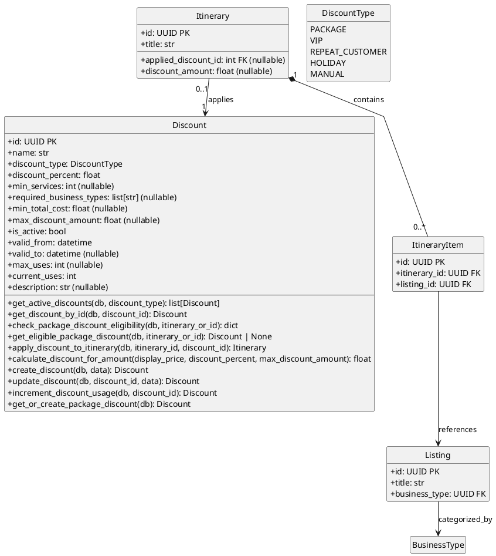

# Discounts Module - Class Diagram (PlantUML)

## Discounts Module - Models with Operations

This diagram shows the Discounts module models and their operations.

| Model | Description |
|-------|-------------|
| **Discount** | Discount entity with eligibility rules |
| **DiscountType** | Enum: PACKAGE, VIP, REPEAT_CUSTOMER, HOLIDAY, MANUAL |

## Key Operations

### Discount

| Operation | Description |
|-----------|-------------|
| `get_active_discounts(db, discount_type)` | Get all active discounts, optionally filtered by type |
| `get_discount_by_id(db, discount_id)` | Get a specific discount by ID |
| `check_package_discount_eligibility(db, itinerary_or_id)` | Check if an itinerary qualifies for package discount |
| `get_eligible_package_discount(db, itinerary_or_id)` | Get the eligible package discount for an itinerary |
| `apply_discount_to_itinerary(db, itinerary_id, discount_id)` | Apply a discount to an itinerary |
| `calculate_discount_for_amount(display_price, discount_percent, max_discount_amount)` | Calculate discount amount with cap |
| `create_discount(db, data)` | Create a new discount |
| `update_discount(db, discount_id, data)` | Update an existing discount |
| `increment_discount_usage(db, discount_id)` | Increment usage counter |
| `get_or_create_package_discount(db)` | Get or create default package discount |

## Package Discount Eligibility Rules

A package discount is eligible when:
1. Discount is active and within valid date range
2. Itinerary has `min_services` or more items
3. Itinerary total cost meets `min_total_cost`
4. Usage count is below `max_uses`
5. All required business types are present in itinerary

## Cross-Module Connections

| Connected Module | Via Model | Relationship |
|-----------------|-----------|--------------|
| **itineraries** | Itinerary | Itinerary can have discount applied (applied_discount_id FK) |
| **listings** | Listing, ItineraryItem | Business types checked for eligibility |
