# Isle Be There - Backend Class Diagram (PlantUML)

```plantuml
@startuml

top to bottom direction

skinparam linetype polyline
skinparam ranksep 40
skinparam nodesep 30
skinparam classAttributeIconSize 0

hide empty members
hide circle

' =========================
' USERS MODULE
' =========================
class User {
    +id: UUID PK
    +email: str UK
    +hashed_password: str
    +username: str UK
    +first_name: str
    +last_name: str
    +user_type: UserTypes
    +is_active: bool
    +is_verified: bool
    +verification_token: str
    +avatar_url: str
    +phone: str
    +birth_date: date
    +interests_handled: bool
    +created_at: datetime
    +updated_at: datetime
    --
    +get_user_by_email(db, email): User | None
    +get_user_by_id(db, user_id): User | None
    +get_user_by_username(db, username): User | None
    +create_user(db, user_data): User
    +update_profile(db, user_id, data): User
    +get_profile(db, user_id): User
    +mark_interests_handled(db, user_id): User
}


' =========================
' BUSINESSES MODULE
' =========================
class Business {
    +id: UUID PK
    +business_name: str
    +description: str
    +business_email: str
    +phone: str
    +address: str
    +website: str
    +logo_url: str
    +is_verified: bool
    +created_at: datetime
    +user_id: UUID FK
    +location: Geography
    --
    +list_businesses(db, skip, limit, verified_only): list[dict]
    +get_business_by_id(db, business_id): dict | None
    +get_business_by_user_id(db, user_id): Business | None
    +create_business(db, data, user_id): dict
    +update_business(db, business_id, update_data, user_id, is_admin): dict
    +get_business_employees(db, user_id): list[dict]
    +add_business_employee(db, business_owner_id, email, password, ...): dict
    +update_business_employee(db, business_owner_id, employee_id, ...): dict
}

class BusinessType {
    +id: UUID PK
    +created_at: datetime
    +name: str UK
    +description: str
    --
    +list_business_types(db): list[BusinessType]
}


' =========================
' LISTINGS MODULE
' =========================
class Listing {
    +id: UUID PK
    +created_at: datetime
    +business_id: UUID FK
    +title: str
    +description: str
    +address: dict (JSONB)
    +base_price: Decimal
    +business_type: UUID FK
    +updated_at: datetime
    +image_urls: list[str]
    +status: Statuses
    +phone_number: str
    +email_address: str
    +location: Geography
    +embedding: vector
    +details: dict (JSONB)
    --
    +list_listings(db, skip, limit, city, country, ...): list[dict]
    +get_listing_by_id(db, listing_id): dict
    +create_listing(db, data, user_id): dict
    +update_listing(db, listing, update_data, is_admin): dict
    +delete_listing(db, listing): Listing
    +get_active_listings(db, limit): list[dict]
    +get_business_listings(db, user_id): list[dict]
    +get_personalized_listings(db, user_id, limit): list[dict]
    +search_listings_combined(db, q, lat, lng, radius_km, limit): list[dict]
    +filter_by_availability(db, listings, start_dt, end_dt, requested_quantity): list[Listing]
    +get_cities_for_country(db, country): dict
}

enum Statuses {
    active
    inactive
    suspended
    pending
    approved
    rejected
}

class EmployeeListings {
    +id: UUID PK
    +employee_id: UUID FK
    +listing_id: UUID FK
}

Listing --> Statuses : <<uses>>


' =========================
' SERVICES MODULE
' =========================
class Service {
    +service_id: UUID PK
    +created_at: datetime
    +name: str
    +description: str
    +price: float
    +season_price: float
    +status: StatusTypes
    +capacity: int
    +availability: dict
    +type_data: dict
    +updated_at: datetime
    +listing_id: UUID FK
    +image_urls: list[str]
    --
    +get_service_by_id(db, service_id): Service
    +get_services(db): list[Service]
    +get_services_by_listing(db, listing_id, user_type): list[Service]
    +get_services_by_listing_ids(db, listing_ids, user_type): list[Service]
    +create_service(db, data, user_id): Service
    +update_service(db, service_id, data): Service
    +delete_service(db, service_id): Service
    +deactivate_service(db, service_id): Service
}

enum StatusTypes {
    active
    inactive
    deleted
}

Service --> StatusTypes : <<uses>>


' =========================
' AVAILABILITY MODULE
' =========================
class ListingHours {
    +id: int PK
    +listing_id: UUID FK
    +day_of_week: int
    +open_time: time
    +close_time: time
    --
    +get_listing_hours(db, listing_id, day): ListingHours | None
    +list_listing_hours(db, listing_id): list[ListingHours]
    +create_listing_hours(db, data): ListingHours
    +update_listing_hours(db, listing_id, day, data): ListingHours
    +delete_listing_hours(db, listing_id, day): None
}

class ServiceSlots {
    +id: int PK
    +service_id: UUID FK
    +day_of_week: int
    +start_time: time
    +end_time: time
    +capacity: int
    --
    +get_service_slot(db, slot_id): ServiceSlots | None
    +get_service_slot_for_service(db, service_id, slot_id): ServiceSlots | None
    +list_service_slots(db, service_id): list[ServiceSlots]
    +create_service_slot(db, data): ServiceSlots
    +update_service_slot(db, service_id, slot_id, data): ServiceSlots
    +delete_service_slot(db, service_id, slot_id): None
    +is_available(db, service_id, capacity, start_dt, end_dt, requested_quantity): bool
    +get_service_availability(db, service_id, date, people): ServiceAvailableResponse
    +get_bulk_service_availability(db, requests): BulkServiceAvailabilityResponse
    +get_mass_availability(db, service_id, start_date, end_date, people): MassAvailabilityResponse
}


' =========================
' BOOKINGS MODULE
' =========================
class Booking {
    +id: UUID PK
    +service_id: UUID FK
    +booking_from_time: datetime
    +booking_to_time: datetime
    +status: BookingStatus
    +user_id: UUID FK
    +created_at: datetime
    +updated_at: datetime
    +amount_of_people: int
    +special_requests: str
    +bookers_name: str
    +base_price: float
    +service_fee_percent: float
    +service_fee_amount: float
    +discount_percent: float
    +discount_amount: float
    +display_price: float
    +final_price: float
    +itinerary_item_id: UUID FK (nullable)
    +stripe_payment_intent_id: str
    --
    +list_bookings(db, user_id): list[BookingResponse]
    +get_booking_by_id(db, booking_id, user_id): BookingResponse
    +list_bookings_for_listing(db, listing_id): list[BookingResponse]
    +create_booking(db, booking, user_id): Booking
    +create_bulk_bookings(db, items, user_id): list[Booking]
    +update_booking(db, booking, update_data): Booking
    +cancel_booking(db, booking, cancelled_by_role, cancellation_reason): Booking
    +delete_booking(db, booking): None
    +create_payment_intent(db, booking_id, user_id): dict
    +price_booking_by_id(db, booking_id, user_id): dict
    +check_booking_conflict(db, service_id, from_time, to_time, exclude_booking_id): bool
    +update_expired_bookings(db): dict
}

enum BookingStatus {
    pending
    cancelled
    approved
    completed
}

Booking --> BookingStatus : <<uses>>


' =========================
' REVIEWS MODULE
' =========================
class Review {
    +id: UUID PK
    +listing_id: UUID FK
    +user_id: UUID FK
    +rating: int
    +comment: str
    +created_at: datetime
    +updated_at: datetime
    +detected_language: str
    +classification_labels: str
    +classified_at: datetime
    +translated_comment: str
    +censored_comment: str
    --
    +list_reviews(db, listing_id, current_user): list[dict]
    +submit_review(db, user_id, review_request): dict
    +update_review(db, review, review_request): dict
    +delete_review(db, review): None
    +create_business_reply(db, review_id, current_user, description): dict
    +get_business_reply(db, review_id): dict | None
    +update_business_reply(db, review_id, current_user, description): dict
    +delete_business_reply(db, review_id, current_user): None
}

class BusinessReply {
    +id: UUID PK
    +created_at: datetime
    +updated_at: datetime
    +business_id: UUID FK
    +user_id: UUID FK
    +review_id: UUID FK
    +description: str
}


' =========================
' FAVOURITES MODULE
' =========================
class Favourites {
    +id: UUID PK
    +user_id: UUID FK
    +listing_id: UUID FK
    +created_at: datetime
    --
    +list_favourites(db, user_id): list[dict]
    +add_favourite(db, user_id, listing_id): dict
    +remove_favourite(db, user_id, listing_id): None
}


' =========================
' ITINERARIES MODULE
' =========================
class Itinerary {
    +id: UUID PK
    +user_id: UUID FK
    +title: str
    +start_date: date
    +end_date: date
    +status: ItineraryStatus
    +budget_level: str
    +pace: str
    +country: str
    +interests: dict
    +total_estimated_cost: float
    +created_at: datetime
    +updated_at: datetime
    +applied_discount_id: int FK
    +discount_amount: float
    --
    +list_saved_itineraries(db, user_id): list[SavedItinerarySummaryResponse]
    +get_saved_itinerary(db, user_id, itinerary_id): SavedItineraryResponse
    +create_itinerary(db, user_id, data): Itinerary
    +save_itinerary(db, user_id, itinerary_id, data): Itinerary
    +confirm_itinerary(db, user_id, itinerary_id): Itinerary
    +delete_saved_itinerary(db, user_id, itinerary_id): None
    +convert_itinerary_to_bookings(db, user_id, itinerary_id): list[Booking]
    +plan_itinerary(db, user_id, data): PlanItineraryResponse
    +send_saved_itinerary_email(user_id, itinerary_id): None
    +send_unsaved_itinerary_email(user_id, data): None
}

enum ItineraryStatus {
    DRAFT
    SAVED
    CONFIRMED
    CANCELLED
    COMPLETED
    ARCHIVED
}

class ItineraryItem {
    +id: UUID PK
    +itinerary_id: UUID FK
    +listing_id: UUID FK
    +linked_booking_id: UUID FK (nullable)
    +title: str
    +description: str
    +day_date: date
    +start_at: datetime
    +end_at: datetime
    +sort_order: int
    +estimated_cost: float
    +address_snapshot: dict
    +reason_tags: dict
    +extra_metadata: dict
    +created_at: datetime
    +updated_at: datetime
    --
    +build_items_for_saved_itinerary(db, itinerary): list[ItineraryItem]
    +serialize_saved_itinerary(itinerary, items): dict
}

Itinerary --> ItineraryStatus : <<uses>>


' =========================
' PRICING MODULE
' =========================
class PlatformPricingConfig {
    +id: UUID PK
    +business_type_id: UUID FK (nullable)
    +service_fee_percent: float
    +is_active: bool
    +effective_from: datetime
    +effective_to: datetime
    --
    +get_pricing_config(db, business_type_id): PlatformPricingConfig
    +calculate_display_price(db, listing_id, service_id): dict
    +get_listing_display_price(db, listing_id, service_id): dict
    +create_pricing_config(db, data): PlatformPricingConfig
    +update_pricing_config(db, config_id, data): PlatformPricingConfig
}


' =========================
' DISCOUNT MODULE
' =========================
class Discount {
    +id: UUID PK
    +name: str
    +discount_type: DiscountType
    +discount_percent: float
    +min_services: int
    +required_business_types: list[str]
    +min_total_cost: float
    +max_discount_amount: float
    +is_active: bool
    +valid_from: datetime
    +valid_to: datetime
    +max_uses: int
    +current_uses: int
    +description: str
    --
    +get_active_discounts(db, discount_type): list[Discount]
    +get_discount_by_id(db, discount_id): Discount
    +check_package_discount_eligibility(db, itinerary_or_id): dict
    +get_eligible_package_discount(db, itinerary_or_id): Discount | None
    +apply_discount_to_itinerary(db, itinerary_id, discount_id): Itinerary
    +calculate_discount_for_amount(display_price, discount_percent, max_discount_amount): float
    +create_discount(db, data): Discount
    +update_discount(db, discount_id, data): Discount
    +increment_discount_usage(db, discount_id): Discount
    +get_or_create_package_discount(db): Discount
}

enum DiscountType {
    PACKAGE
    VIP
    REPEAT_CUSTOMER
    HOLIDAY
    MANUAL
}


' =========================
' STRIPE PAYMENT MODULE
' =========================
class PaymentEvent {
    +id: UUID PK
    +booking_id: UUID FK
    +event_type: str
    +stripe_payment_intent_id: str
    +amount_cents: int
    +created_at: datetime
    --
    +create_payment_intent(db, booking_id, user_id): dict
    +process_refund(db, booking): dict
    +confirm_payment(db, booking): dict
}


' =========================
' CROSS-MODULE RELATIONSHIPS
' =========================

' User -> Business (1-to-many) - User owns businesses
User "1" *-- "0..*" Business : owns

' User -> Booking (1-to-many) - User books services
User "1" --> "0..*" Booking : books

' User -> Review (1-to-many) - User writes reviews
User "1" --> "0..*" Review : writes

' User -> Favourites (1-to-many) - User saves listings
User "1" --> "0..*" Favourites : saves

' User -> Itinerary (1-to-many) - User creates itineraries
User "1" --> "0..*" Itinerary : creates

' Business -> Listing (1-to-many) - Business has listings
Business "1" *-- "0..*" Listing : has

' BusinessType -> Listing (1-to-many) - BusinessType categorizes listings
BusinessType "1" --> "0..*" Listing : categorizes

' Listing -> Service (1-to-many) - Listing offers services
Listing "1" o-- "0..*" Service : offers

' Listing -> ListingHours (1-to-many) - Listing has operating hours
Listing "1" o-- "0..*" ListingHours : operates

' Listing -> Review (1-to-many) - Listing has reviews
Listing "1" --> "0..*" Review : has

' Listing -> Favourites (1-to-many) - Listing is saved in favourites
Listing "1" --> "0..*" Favourites : saved_in

' Listing -> ItineraryItem (1-to-many) - Listing referenced by itinerary items
Listing "1" --> "0..*" ItineraryItem : referenced_by

' Service -> ServiceSlots (1-to-many) - Service has availability slots
Service "1" *-- "0..*" ServiceSlots : has

' Service -> Booking (1-to-many) - Service is booked
Service "1" --> "0..*" Booking : booked_in

' Itinerary -> ItineraryItem (composition - 1-to-many)
Itinerary "1" *-- "0..*" ItineraryItem : contains

' ItineraryItem -> Booking (0..1-to-1) - ItineraryItem books a booking
ItineraryItem "0..1" *-- "1" Booking : books

' Business -> BusinessReply (1-to-many) - Business writes replies
Business "1" o-- "0..*" BusinessReply : writes

' Review -> BusinessReply (1-to-0..1) - Review receives reply
Review "1" --> "0..1" BusinessReply : receives

' EmployeeListings relationships
Listing "1" *-- "0..*" EmployeeListings : has employees
EmployeeListings --> User : assigned to

' Itinerary applies Discount (0..1-to-1)
Itinerary "0..1" --> "1" Discount : applies

' Booking generates PaymentEvents (1-to-many)
Booking "1" --> "0..*" PaymentEvent : generates

@enduml
```

## Module Inventory (Models + Operations)

| Module | Models | Description |
|--------|--------|-------------|
| auth | User | Authentication (register, login, token refresh, password reset, email verification) |
| users | User | User management and profile operations |
| businesses | Business, BusinessType | Business profiles and categories |
| listings | Listing, EmployeeListings, Statuses | Travel experiences |
| services | Service, StatusTypes | Bookable offerings |
| availability | ListingHours, ServiceSlots | Operating hours and time slots |
| bookings | Booking, BookingStatus | Reservations |
| reviews | Review, BusinessReply | User feedback |
| favourites | Favourites | Saved listings |
| itineraries | Itinerary, ItineraryItem, ItineraryStatus | Trip planning |
| pricing | PlatformPricingConfig | Platform fee configuration |
| discounts | Discount, DiscountType | Discount eligibility and application |
| stripe_payment | PaymentEvent | Payment processing and refunds |

## Cross-Module Relationships Summary

| From | To | Relationship | Via FK |
|------|-----|--------------|--------|
| User | Business | owns | user_id |
| User | Booking | books | user_id |
| User | Review | writes | user_id |
| User | Favourites | saves | user_id |
| User | Itinerary | creates | user_id |
| Business | Listing | has | business_id |
| BusinessType | Listing | categorizes | business_type |
| Listing | Service | offers | listing_id |
| Listing | ListingHours | operates | listing_id |
| Listing | Review | has | listing_id |
| Listing | Favourites | saved_in | listing_id |
| Listing | ItineraryItem | referenced_by | listing_id |
| Service | ServiceSlots | has | service_id |
| Service | Booking | booked_in | service_id |
| Itinerary | ItineraryItem | contains | itinerary_id |
| ItineraryItem | Booking | books | linked_booking_id |
| Business | BusinessReply | writes | business_id |
| Review | BusinessReply | receives | review_id |
| Itinerary | Discount | applies | applied_discount_id |
| Booking | PaymentEvent | generates | booking_id |
