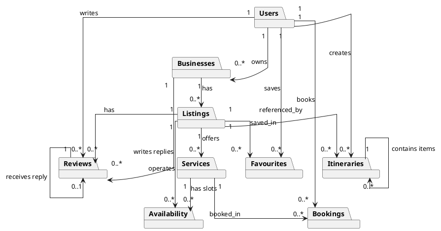

# Isle Be There - Simplified Class Diagram

> Shows how modules connect via their **models** (data entities), not internal implementation.

---

## Models by Module

| Module | Models | Key Operations |
|--------|--------|----------------|
| **Auth** | User | register_user, authenticate_user, build_token_response, refresh_user_token, reset_password, verify_email |
| **Users** | User | get_user_by_email, create_user, update_profile, get_profile, mark_interests_handled |
| **Businesses** | Business, BusinessType | list_businesses, get_business_by_id, create_business, update_business, get_business_employees, add_business_employee |
| **Listings** | Listing, EmployeeListings, Statuses | list_listings, get_listing_by_id, create_listing, update_listing, delete_listing, search_listings_combined |
| **Services** | Service, StatusTypes | get_services, create_service, update_service, delete_service, deactivate_service |
| **Availability** | ListingHours, ServiceSlots | list_listing_hours, create_listing_hours, list_service_slots, get_service_availability, is_available |
| **Bookings** | Booking, BookingStatus | list_bookings, create_booking, update_booking, cancel_booking, create_payment_intent, price_booking |
| **Reviews** | Review, BusinessReply | list_reviews, submit_review, update_review, delete_review, create_business_reply |
| **Favourites** | Favourites | list_favourites, add_favourite, remove_favourite |
| **Itineraries** | Itinerary, ItineraryItem, ItineraryStatus | create_itinerary, save_itinerary, confirm_itinerary, plan_itinerary, convert_to_bookings |
| **Pricing** | PlatformPricingConfig | get_pricing_config, calculate_display_price |
| **Discounts** | Discount, DiscountType | get_active_discounts, check_package_discount_eligibility, apply_discount_to_itinerary |
| **Stripe Payment** | PaymentEvent | create_payment_intent, process_refund, confirm_payment |

---

## PlantUML Diagram



---

## Module Relationships

### Users Module
```
User ──> Business       (1-to-many) — owns
User ──> Booking       (1-to-many) — books
User ──> Review        (1-to-many) — writes
User ──> Favourites    (1-to-many) — saves
User ──> Itinerary     (1-to-many) — creates
```

### Businesses Module
```
Business ──> Listing (1-to-many) — has
Business ──> Review   (1-to-many) — writes replies
```

### Listings Module
```
Listing ──> Service (1-to-many) — offers
Listing ──> ListingHours  (1-to-many) — operates
Listing ──> Review       (1-to-many) — has
Listing ──> Favourites   (1-to-many) — saved_in
Listing ──> ItineraryItem (1-to-many) — referenced_by
```

### Services Module
```
Service ──> ServiceSlots  (1-to-many) — has slots
Service ──> Booking (1-to-many) — booked_in
```

### Availability Module
```
ServiceSlots ──> Booking (checked against for availability)
ListingHours   ──> Listing (belongs to)
```

### Bookings Module
```
Booking ──> ItineraryItem  (optional link)
Booking ──> PaymentEvent   (generates)
```

### Reviews Module
```
Review ──> BusinessReply  (0..1-to-1) — receives reply
```

### Itineraries Module
```
Itinerary ──> ItineraryItem  (1-to-many) — contains
ItineraryItem ──> Booking    (0..1-to-1) — books
```

---

## Module Dependencies

```
users ──> (standalone)
businesses   ──> users
listings      ──> businesses
services      ──> listings
availability  ──> listings, services
bookings      ──> services, availability, users, itineraries
reviews       ──> listings, users, businesses
favourites    ──> listings, users
itineraries   ──> listings, bookings, users
```

---

## File Structure

```
solution_models/Class/
├── class_diagram.md              # Full model relationship diagram
├── simplified_class_diagram.md   # This file
├── 01_auth_module.md             # User
├── 02_users_module.md            # User
├── 03_businesses_module.md       # Business, BusinessType
├── 04_listings_module.md        # Listing, EmployeeListings
├── 05_services_module.md        # Service
├── 06_availability_module.md     # ListingHours, ServiceSlots
├── 07_bookings_module.md        # Booking
├── 08_reviews_module.md         # Review, BusinessReply
├── 09_favourites_module.md      # Favourites
├── 10_itineraries_module.md     # Itinerary, ItineraryItem
├── 11_pricing_module.md         # PlatformPricingConfig
└── 12_discounts_module.md       # Discount
```
