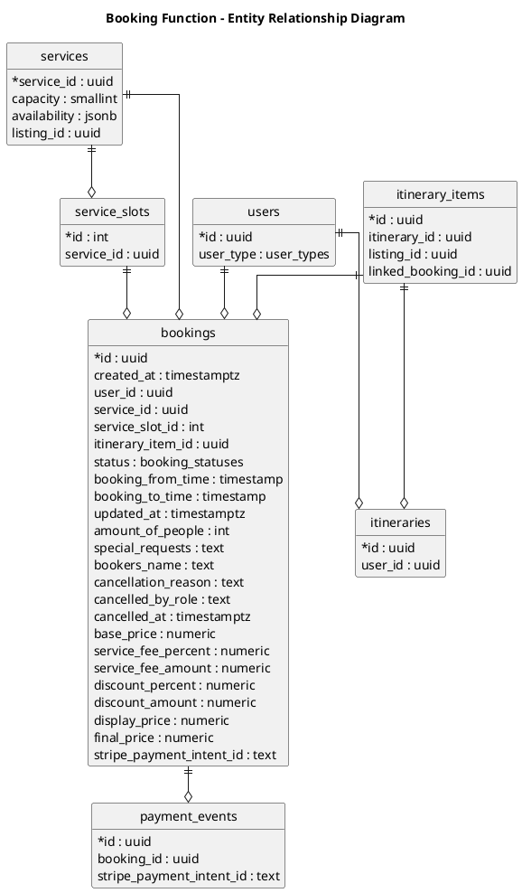

# Isle Be There - Booking Function ERD

## Entity Summary

### Primary Entities

| Entity | Description |
|--------|-------------|
| bookings | Core booking record with pricing, timing, status, and payment info |
| payment_events | Stripe payment lifecycle events tied to a booking |
| services | Service offerings that can be booked |
| service_slots | Available time slots for a service |

### Supporting Entities

| Entity | Description |
|--------|-------------|
| users | The user making the booking |
| listings | Business listings that contain services |
| itinerary_items | Optional link between booking and itinerary |
| itineraries | Users trip plan containing multiple items |
| discounts | Discount rules that can apply to bookings |
| pricing_configs | Service fee percentage by business type |
| business_types | Category of business for pricing configuration |

## Booking Flow

Users makes bookings for services that are contained in listings and scheduled via service_slots.

## Pricing Calculation

display_price = base_price
service_fee_amount = base_price * service_fee_percent
discount_amount = display_price * discount_percent
final_price = display_price + service_fee_amount - discount_amount

## Status Flow

pending - confirmed - completed
cancelled (with cancellation_reason, cancelled_by_role, cancelled_at)
