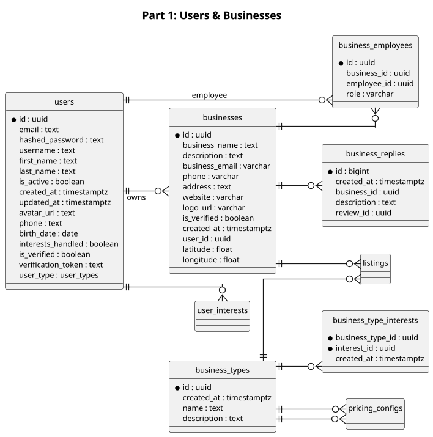
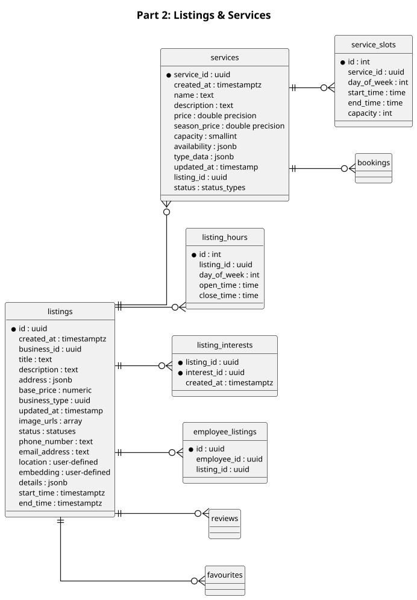
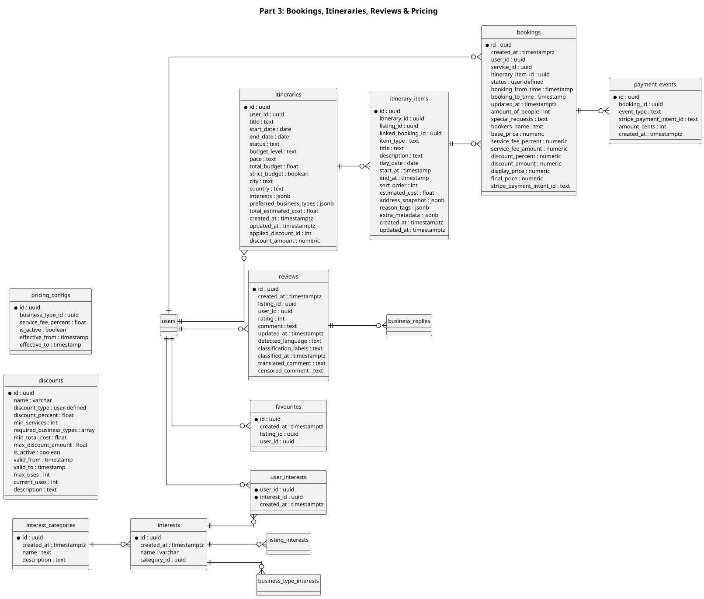

# Isle Be There - ERD Diagrams (3-Part A4)

## Part 1: Users & Businesses

---

## Part 2: Listings & Services

---

## Part 3: Bookings, Itineraries, Reviews & Pricing

---

## Usage Notes

### Export Settings for A4
- **DPI**: 120 (optimized for print)
- **Font Size**: 10pt
- **Wrap Width**: 280
- **Format**: PNG or PDF
- **Layout**: Horizontal (left to right)

### Diagram Breakdown
- **Part 1**: Users, Businesses, Business Employees, Business Types, Business Replies
- **Part 2**: Listings, Services, Service Slots, Listing Hours, Employee Listings
- **Part 3**: Bookings, Payments, Itineraries, Itinerary Items, Reviews, Favourites, Interests, Discounts, Pricing

### PlantUML Export (VS Code)
- `Alt+D` to preview
- `Alt+P` to export as PNG

### Cross-Diagram Relationships
Note that some relationships reference entities in other parts:
- `business_types ||--o{ business_type_interests` → Part 1
- `listings ||--o{ listing_interests` → Part 2
- `user_interests` → Part 1 (Users) to Part 3 (Interests)
- `employee_listings` → Part 1 (Users) to Part 2 (Listings)