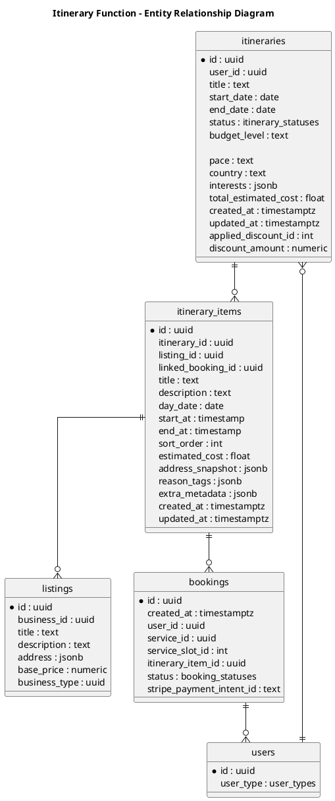

# Isle Be There - Itinerary Function ERD

## Entity Summary

### Core Entities

| Entity | Description |
|--------|-------------|
| itineraries | User trip plan with dates, budget, and preferences |
| itinerary_items | Individual items/activities in an itinerary |

### Supporting Entities

| Entity | Description |
|--------|-------------|
| users | User who creates and owns the itinerary |
| listings | Business listings referenced by itinerary items |
| bookings | Bookings linked from itinerary items |

## Itinerary Flow

Users create itineraries and add items to them. Each item can reference a listing and optionally link to a booking.

## Status Flow

Itinerary status: draft - planned - in_progress - completed
Item status: pending - confirmed - cancelled

## PlantUML Legend

| Symbol | Meaning |
|--------|---------|
| ||--o{ | One-to-Many |
| }o--|| | Many-to-One |
| * | Primary Key |