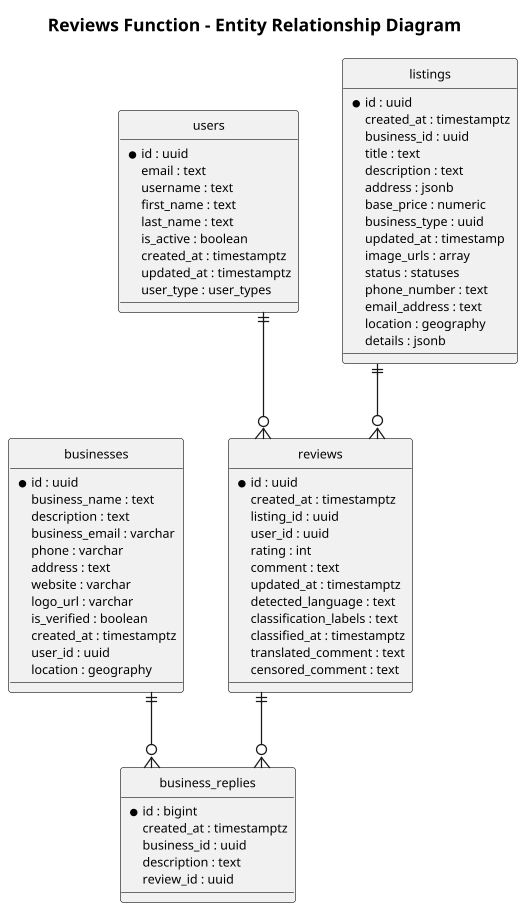

# Isle Be There - Reviews Function ERD

## Entity Summary

### Core Entities

| Entity | Description |
|--------|-------------|
| reviews | User reviews for listings with rating and comment |
| business_replies | Business owner replies to reviews |

### Supporting Entities

| Entity | Description |
|--------|-------------|
| users | User who writes the review |
| listings | Listing being reviewed |
| businesses | Business that can reply to reviews |

## Review Flow

Users write reviews for listings with a rating (1-5) and comment. Businesses can reply to reviews. Reviews have AI-assisted language detection, classification, translation, and content moderation.

## Rating System

Reviews include a rating integer. Comments may be processed for:
- Language detection (detected_language)
- Content classification (classification_labels)
- Translation (translated_comment)
- Content moderation (censored_comment)

## PlantUML Legend

| Symbol | Meaning |
|--------|---------|
| ||--o{ | One-to-Many |
| }o--|| | Many-to-One |
| * | Primary Key |