# Isle Be There - ORM Diagram

## ORM Model (Object View)

```plantuml
@startuml

hide circle
skinparam linetype ortho
skinparam classAttributeIconSize 0

' =========================
' USER MODULE
' =========================
class User {
    - id : UUID PK
    - email : str UK
    - username : str UK
    - hashed_password : str
    - first_name : str
    - last_name : str
    - user_type : enum
    - is_active : bool
    - is_verified : bool
    - avatar_url : str
    - phone : str
    - birth_date : date
    - created_at : datetime

    + bookings : List<Booking>
    + reviews : List<Review>
    + favourites : List<Favourite>
    + itineraries : List<Itinerary>
    + employee_listings : List<EmployeeListing>
}

' =========================
' BUSINESS MODULE
' =========================
class Business {
    - id : UUID PK
    - user_id : UUID FK → User
    - business_name : str
    - is_verified : bool
    - created_at : datetime

    + owner : User
    + listings : List<Listing>
    + employees : List<BusinessEmployee>
}

class BusinessEmployee {
    - id : UUID PK
    - business_id : UUID FK → Business
    - employee_id : UUID FK → User
}

' =========================
' LISTING MODULE
' =========================
class Listing {
    - id : UUID PK
    - business_id : UUID FK → Business
    - title : str
    - description : str
    - base_price : decimal
    - status : enum
    - image_urls : list~str~
    - location : Geography
    - embedding : vector
    - details : dict
    - created_at : datetime

    + business : Business
    + services : List<Service>
    + reviews : List<Review>
    + favourites : List<Favourite>
    + hours : List<ListingHours>
    + itinerary_items : List<ItineraryItem>
    + employee_listings : List<EmployeeListing>
}

class EmployeeListing {
    - id : UUID PK
    - employee_id : UUID FK → User
    - listing_id : UUID FK → Listing
}

' =========================
' SERVICE MODULE
' =========================
class Service {
    - service_id : UUID PK
    - listing_id : UUID FK → Listing
    - name : str
    - description : str
    - price : float
    - season_price : float
    - status : enum
    - capacity : int
    - availability : dict
    - type_data : dict
    - created_at : datetime

    + listing : Listing
    + bookings : List<Booking>
    + slots : List<ServiceSlot>
}

class ServiceSlot {
    - id : int PK
    - service_id : UUID FK → Service
    - day_of_week : int
    - start_time : time
    - end_time : time
    - capacity : int
}

' =========================
' AVAILABILITY MODULE
' =========================
class ListingHours {
    - id : int PK
    - listing_id : UUID FK → Listing
    - day_of_week : int
    - open_time : time
    - close_time : time

    + listing : Listing
}

' =========================
' BOOKING MODULE
' =========================
class Booking {
    - id : UUID PK
    - user_id : UUID FK → User
    - service_id : UUID FK → Service
    - service_slot_id : int FK → ServiceSlot (nullable)
    - itinerary_item_id : UUID FK → ItineraryItem (nullable)
    - status : enum
    - booking_from_time : datetime
    - booking_to_time : datetime
    - amount_of_people : int
    - bookers_name : str
    - special_requests : str
    - cancellation_reason : str
    - cancelled_by_role : str
    - cancelled_at : datetime
    - base_price : decimal
    - service_fee_percent : decimal
    - service_fee_amount : decimal
    - discount_percent : decimal
    - discount_amount : decimal
    - display_price : decimal
    - final_price : decimal
    - stripe_payment_intent_id : str UK
    - created_at : datetime
    - updated_at : datetime

    + user : User
    + service : Service
    + itinerary_item : ItineraryItem (nullable)
    + payments : List<PaymentEvent>
}

' =========================
' REVIEW MODULE
' =========================
class Review {
    - id : UUID PK
    - listing_id : UUID FK → Listing
    - user_id : UUID FK → User
    - rating : int
    - comment : str
    - created_at : datetime
    - updated_at : datetime
    - detected_language : str
    - classification_labels : str
    - classified_at : datetime
    - translated_comment : str
    - censored_comment : str

    + listing : Listing
    + user : User
    + business_reply : BusinessReply
}

class BusinessReply {
    - id : UUID PK
    - review_id : UUID FK → Review (unique)
    - business_id : UUID FK → Business
    - user_id : UUID FK → User
    - description : str
    - created_at : datetime
    - updated_at : datetime
}

' =========================
' FAVOURITE MODULE
' =========================
class Favourite {
    - id : UUID PK
    - user_id : UUID FK → User
    - listing_id : UUID FK → Listing
    - created_at : datetime
    - <<unique>> (user_id, listing_id)

    + user : User
    + listing : Listing
}

' =========================
' ITINERARY MODULE
' =========================
class Itinerary {
    - id : UUID PK
    - user_id : UUID FK → User
    - title : str
    - start_date : date
    - end_date : date
    - status : enum
    - budget_level : str
    - pace : str
    - country : str
    - interests : dict
    - total_estimated_cost : float
    - created_at : datetime
    - updated_at : datetime
    - applied_discount_id : int
    - discount_amount : decimal

    + user : User
    + items : List<ItineraryItem>
}

class ItineraryItem {
    - id : UUID PK
    - itinerary_id : UUID FK → Itinerary
    - listing_id : UUID FK → Listing
    - linked_booking_id : UUID FK → Booking (nullable)
    - title : str
    - description : str
    - day_date : date
    - start_at : datetime
    - end_at : datetime
    - sort_order : int
    - estimated_cost : float
    - address_snapshot : dict
    - reason_tags : dict
    - extra_metadata : dict
    - created_at : datetime
    - updated_at : datetime

    + itinerary : Itinerary
    + listing : Listing
    + booking : Booking (nullable)
}

' =========================
' PAYMENT MODULE
' =========================
class PaymentEvent {
    - id : UUID PK
    - booking_id : UUID FK → Booking
    - event_type : str
    - stripe_payment_intent_id : str
    - amount_cents : int
    - created_at : datetime

    + booking : Booking
}

' =========================
' DISCOUNT MODULE
' =========================
class Discount {
    - id : UUID PK
    - name : str
    - discount_type : DiscountType enum
    - discount_percent : float
    - min_services : int
    - required_business_types : list~str~
    - min_total_cost : float
    - max_discount_amount : float
    - is_active : bool
    - valid_from : datetime
    - valid_to : datetime
    - max_uses : int
    - current_uses : int
    - description : str
}

' =========================
' LOOKUP TABLES
' =========================
class BusinessType {
    - id : UUID PK
    - name : str
}

class Interest {
    - id : UUID PK
    - name : str
    - category_id : UUID FK → InterestCategory
}

class InterestCategory {
    - id : UUID PK
    - name : str
    - description : str
}

' =========================
' JUNCTION TABLES
' =========================
class UserInterest {
    - user_id : UUID FK → User
    - interest_id : UUID FK → Interest
    - created_at : datetime
}

class ListingInterest {
    - listing_id : UUID FK → Listing
    - interest_id : UUID FK → Interest
    - created_at : datetime
}

class BusinessTypeInterest {
    - business_type_id : UUID FK → BusinessType
    - interest_id : UUID FK → Interest
    - created_at : datetime
}

class PricingConfig {
    - id : UUID PK
    - business_type_id : UUID FK → BusinessType
    - service_fee_percent : float
    - is_active : bool
    - effective_from : datetime
    - effective_to : datetime
}

' =========================
' ORM RELATIONSHIPS
' =========================

' COMPOSITION (filled diamond)
User *-- Business
Business *-- Listing
Listing *-- Service
Listing *-- ListingHours
Service *-- ServiceSlot
Itinerary *-- ItineraryItem
Booking *-- PaymentEvent

' AGGREGATION (hollow diamond)
User o-- Booking
User o-- Review
User o-- Favourite
User o-- Itinerary
User o-- BusinessEmployee
User o-- EmployeeListing
User o-- UserInterest

Listing o-- Review
Listing o-- Favourite
Listing o-- ItineraryItem
Listing o-- EmployeeListing
Listing o-- ListingInterest

Business o-- BusinessEmployee
Business o-- BusinessReply
Business o-- BusinessType

Service o-- Booking
Service o-- ServiceSlot

ItineraryItem o-- Booking

' REALIZATION (dashed line)
BusinessType ..> PricingConfig
Interest ..> InterestCategory

' ASSOCIATION (solid arrow)
Review --> User
Favourite --> User
BusinessType --> Listing
ItineraryItem --> Listing
Booking --> ItineraryItem
Interest --> UserInterest
Interest --> ListingInterest
Interest --> BusinessTypeInterest

@enduml
```

## Summary

| Module | ORM Classes |
|--------|-------------|
| users | User, UserInterest |
| businesses | Business, BusinessEmployee, BusinessType |
| listings | Listing, EmployeeListing, ListingHours |
| services | Service, ServiceSlot |
| bookings | Booking, PaymentEvent |
| reviews | Review, BusinessReply |
| favourites | Favourite |
| itineraries | Itinerary, ItineraryItem |
| lookup | Interest, InterestCategory, BusinessTypeInterest, PricingConfig |

## Key Features

1. **PK/FK clearly marked** - Each attribute shows if it's PK or FK
2. **Object relationships** - Shows navigation properties (e.g., `bookings : List<Booking>`)
3. **Nullable indicated** - FK that can be null shown with `(nullable)`
4. **Clean class notation** - No SQL types, pure object model view
5. **All junction tables included** - Many-to-many relationships preserved
6. **Association types** - `*--` (composition), `o--` (aggregation), `..>` (realization), `-->` (association)