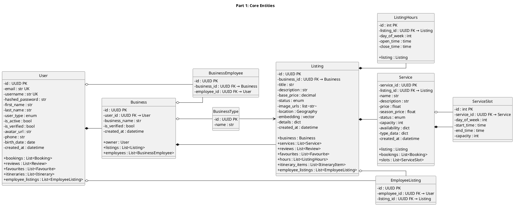
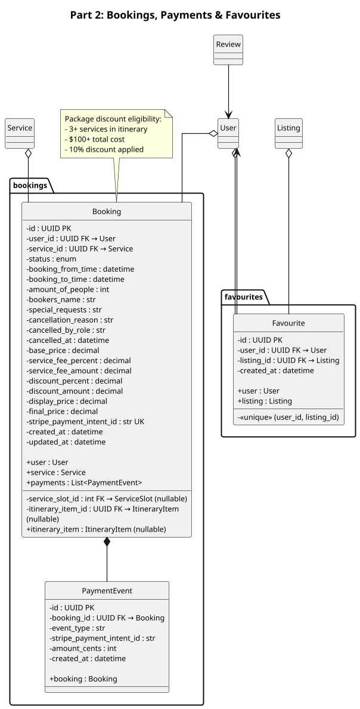
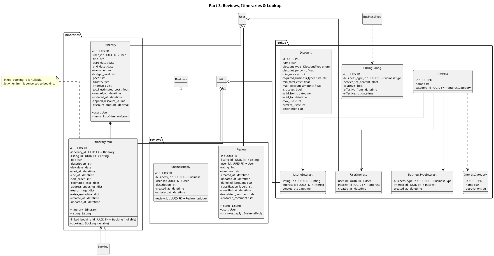

# Isle Be There - ORM Diagrams (3-Part A4)

## Part 1: Core Entities (User, Business, Listing, Service)

---

## Part 2: Bookings, Payments & Favourites

---

## Part 3: Reviews, Itineraries & Lookup

---

## Usage Notes

### Export Settings for A4
- **DPI**: 120 (optimized for print)
- **Font Size**: 10pt
- **Wrap Width**: 250
- **Format**: PNG or PDF

### Diagram Breakdown
- **Part 1**: Core entities - User, Business, Listing, Service and their direct relationships
- **Part 2**: Transactional entities - Booking, PaymentEvent, Favourite
- **Part 3**: Reviews, Itineraries, plus Interest/Pricing/Discount lookup tables

### PlantUML Export (VS Code)
- `Alt+D` to preview
- `Alt+P` to export as PNG