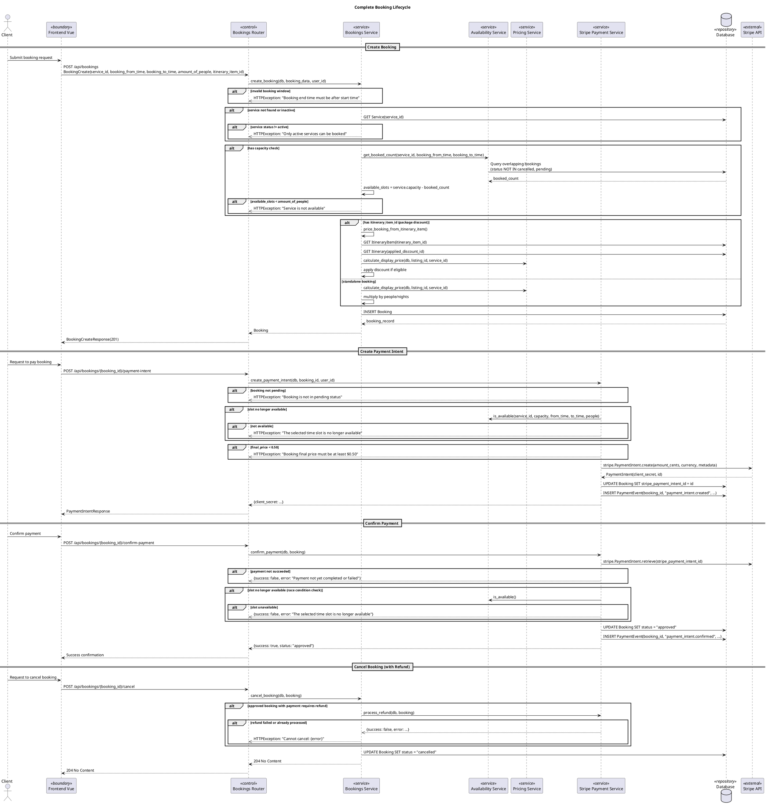
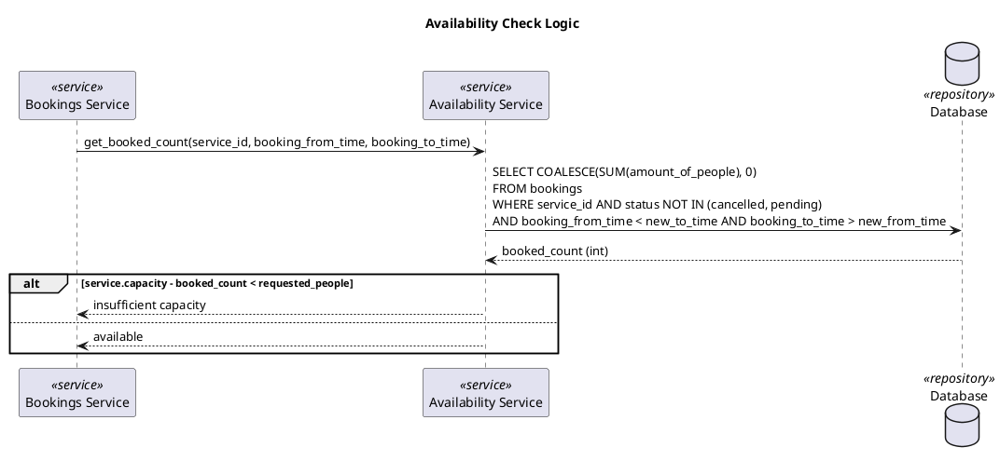
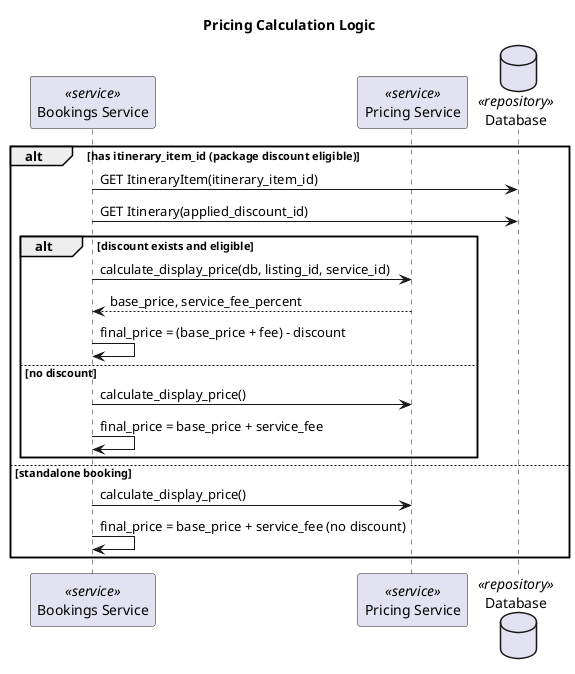
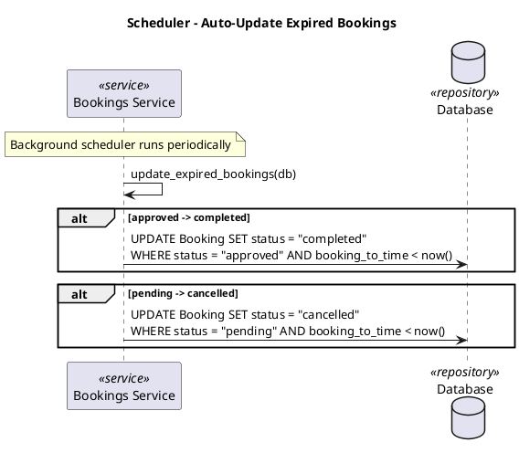

# Booking Flow Sequence Diagrams

> Important business flows only. Basic CRUD patterns are omitted as they follow the same sequence: Router → Service → DB.

## Complete Booking Lifecycle

## Availability Check Logic

## Pricing Calculation Logic

## Scheduler - Auto-Complete/Cancel

