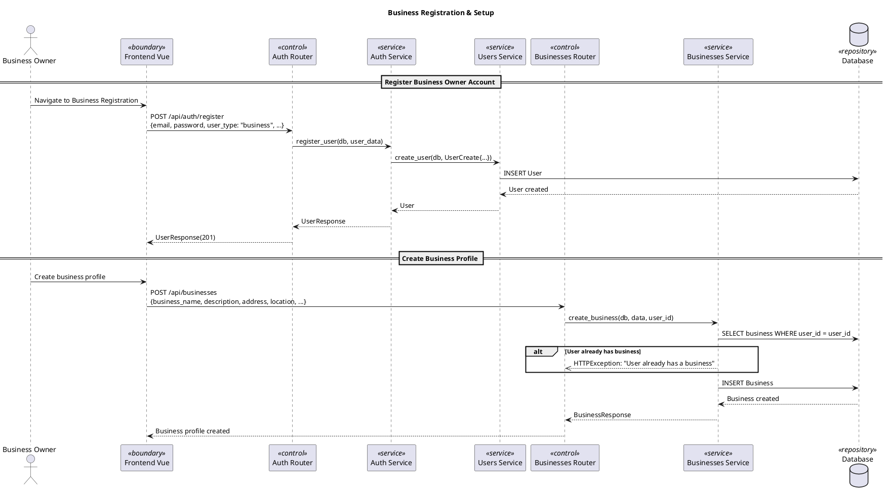
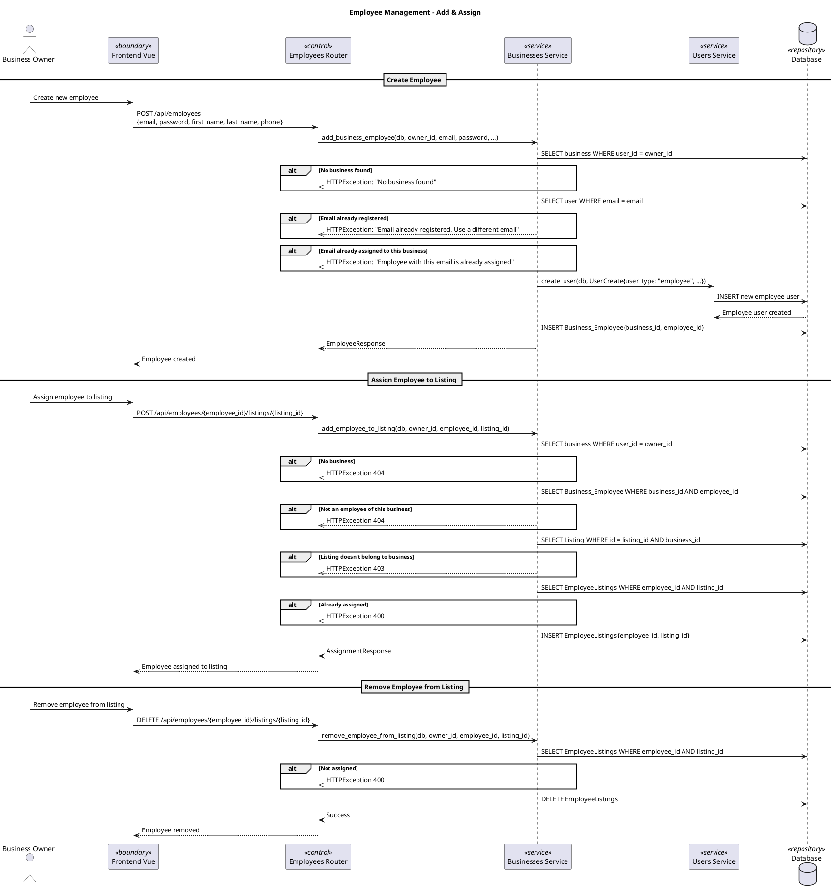
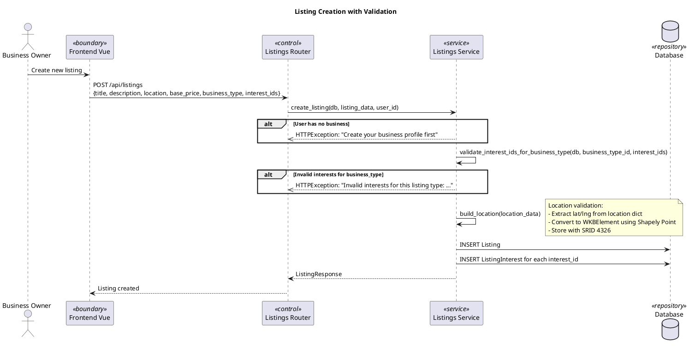
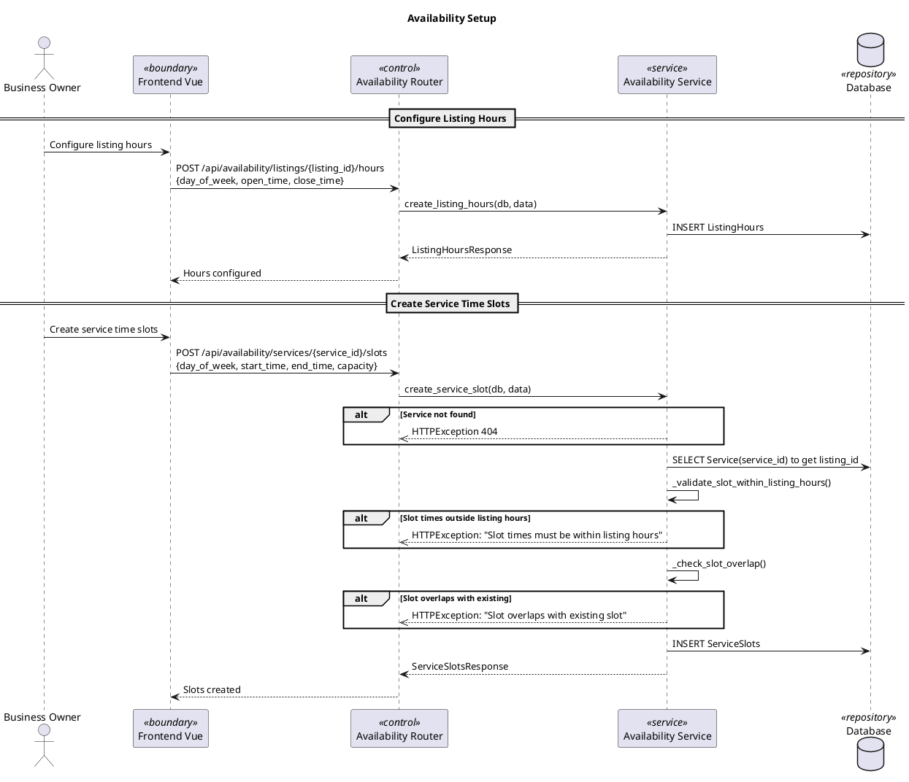

# Business Owner Flow Sequence Diagrams

> Important business flows only. Basic CRUD patterns (view profile, list listings) are omitted as they follow the same sequence: Router → Service → DB.

## Business Registration& Setup

## Employee Management

## Listing Creation with Validation

## Availability Setup

