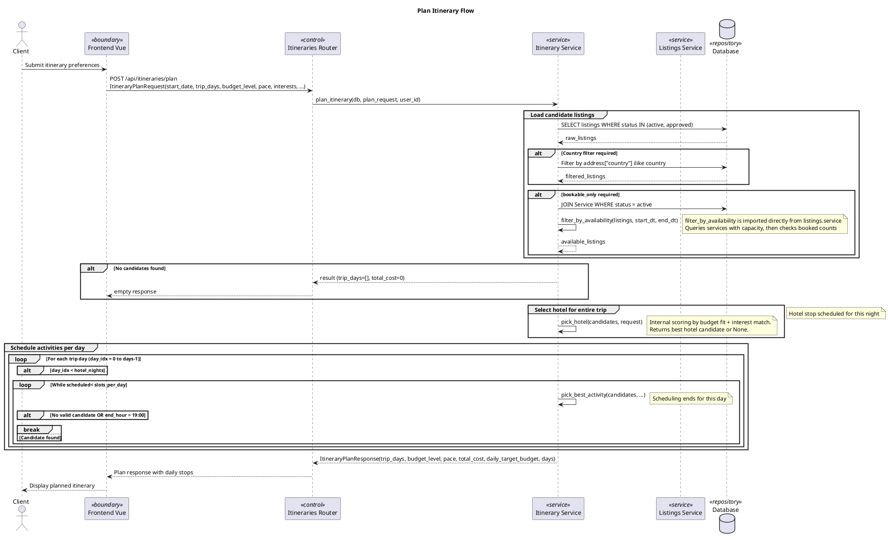
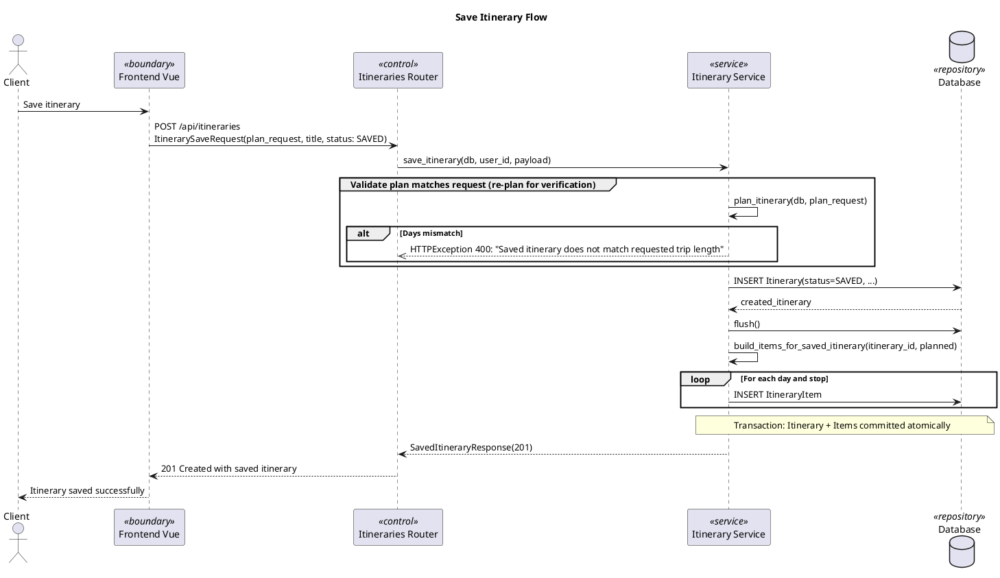
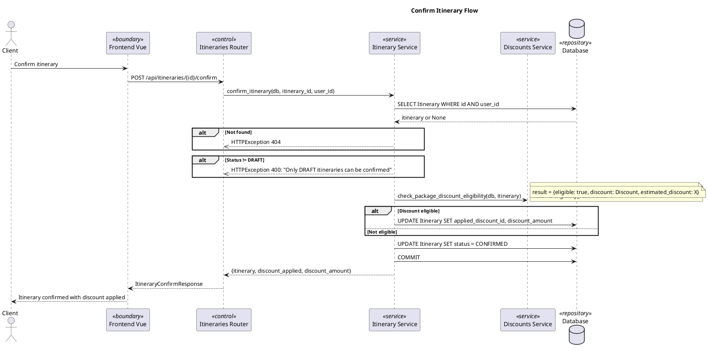
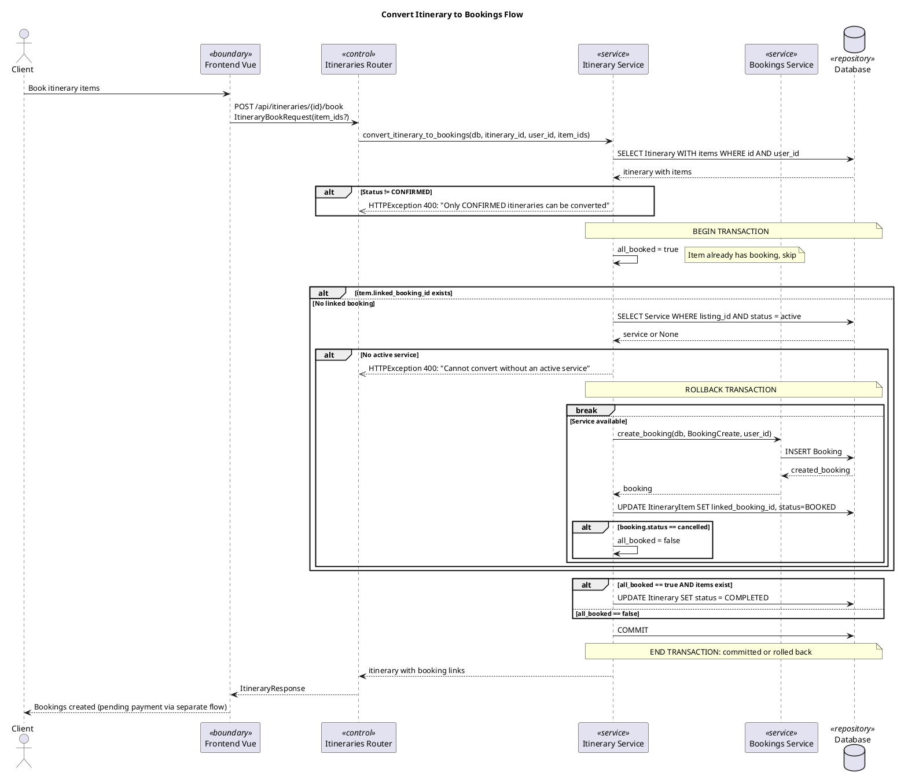

# Itinerary Creation Flow

> Important business flows only. Basic read operations (get itinerary, list itineraries) are omitted.

## Plan Itinerary Flow

## Save Itinerary Flow

## Confirm Itinerary Flow

## Convert Itinerary to Bookings Flow

