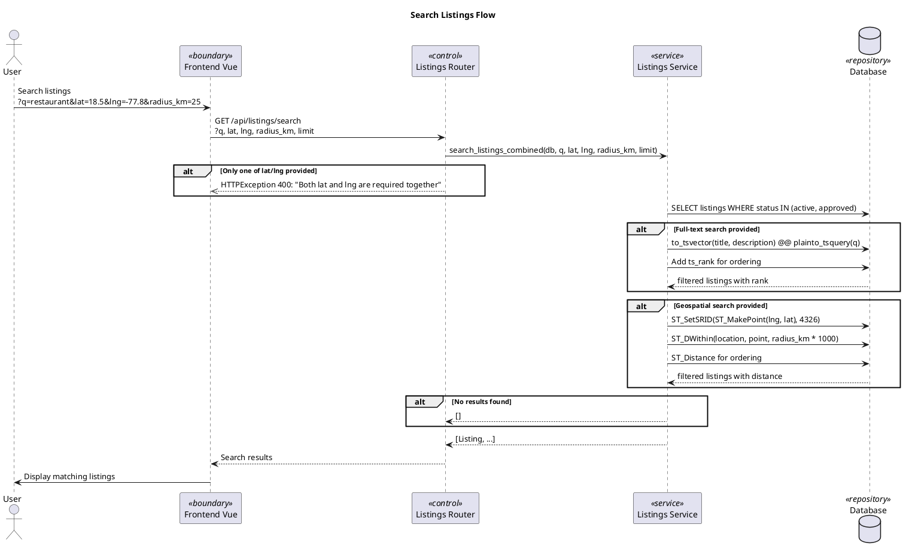
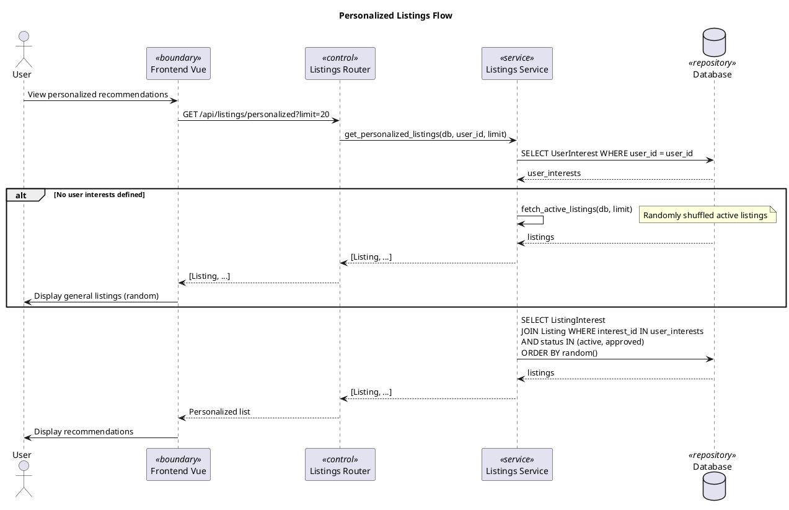
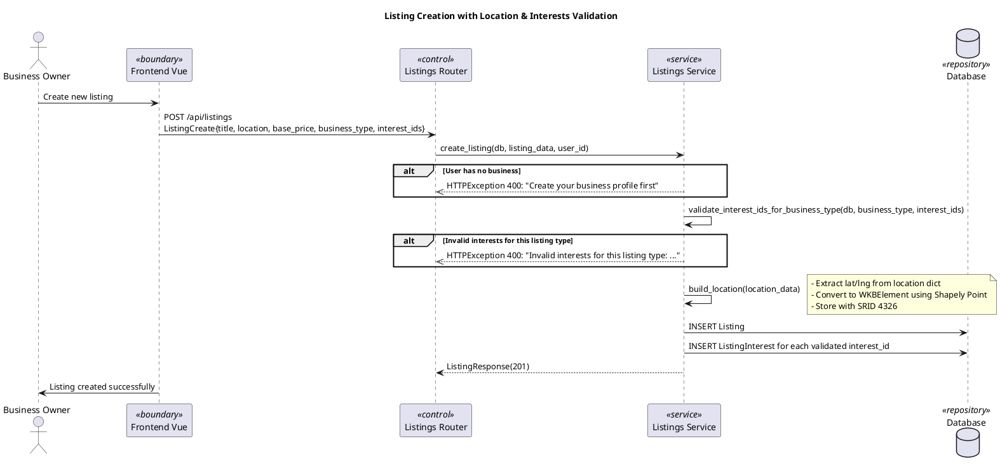
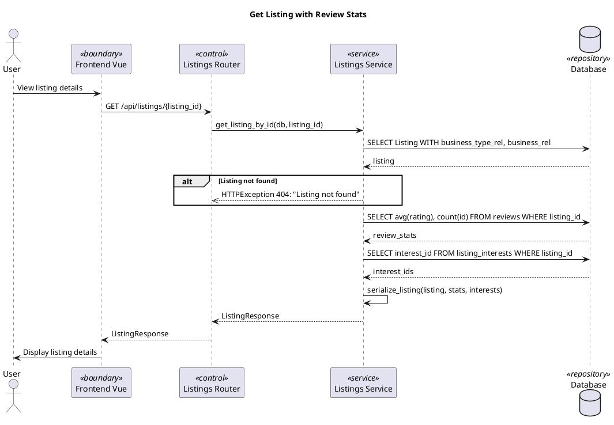

# Listings Module Sequence Diagrams

> Important business flows only. Basic CRUD patterns (create, read, update, delete listing) are omitted as they follow the same sequence: Router → Service → DB.

## Search Listings Flow

## Personalized Listings Flow

## Listing Creation with Location & Interests

## Get Listing with Stats

