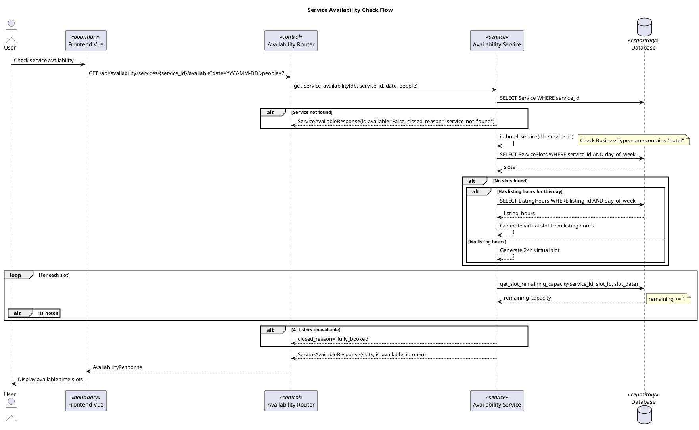
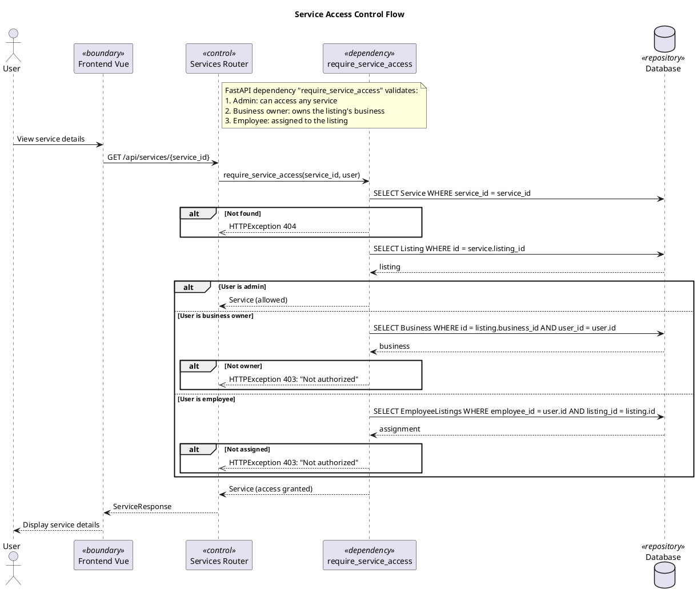
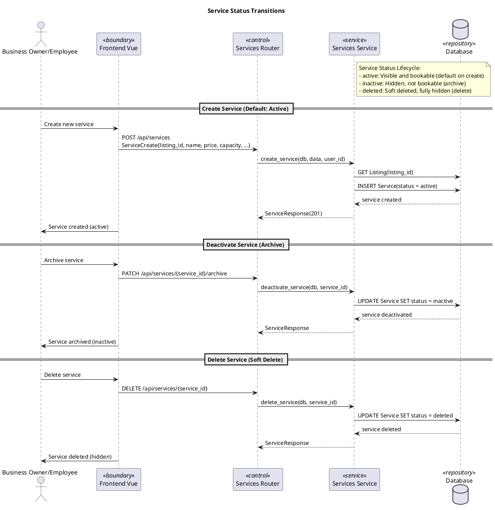
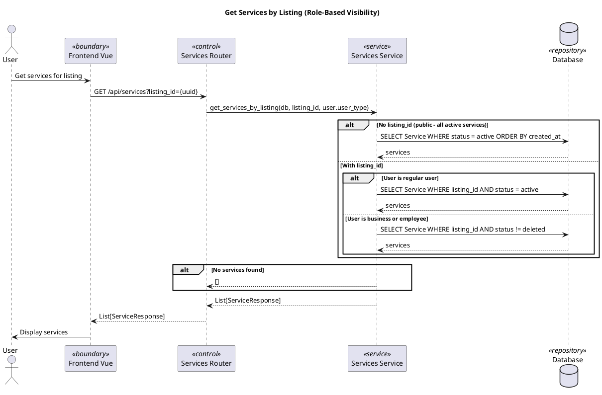

# Services Module - Sequence Diagrams

> Important business flows only. Basic CRUD patterns (create, read, update, delete service) are omitted as they follow the same sequence: Router → Service → DB.

## Service Availability Check Flow

## Service Access Control Flow

## Service Status Transitions

## Get Services by Listing (Role-Based)

