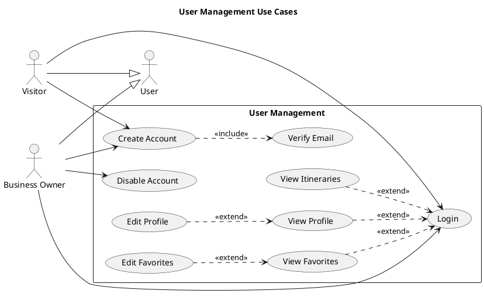

# PlantUML Use Case Diagram: User Management

```plantuml
@startuml
title User Management Use Cases

left to right direction

actor "User" as user
actor "Visitor" as visitor
actor "Business Owner" as business_owner

visitor --|> user
business_owner --|> user

rectangle "User Management" {
  usecase "Login" as UC2
  usecase "Create Account" as UC1
  usecase "Disable Account" as UC3
  usecase "Verify Email" as UC4
  usecase "View Profile" as UC5
  usecase "Edit Profile" as UC6
  usecase "View Favorites" as UC7
  usecase "Edit Favorites" as UC8
  usecase "View Itineraries" as UC9
}


visitor --> UC1
visitor --> UC2
business_owner --> UC1
business_owner --> UC2
business_owner --> UC3

UC1 ..> UC4 : <<include>>
UC5 ..> UC2 : <<extend>>
UC7 ..> UC2 : <<extend>>
UC9 ..> UC2 : <<extend>>
UC6 ..> UC5 : <<extend>>
UC8 ..> UC7 : <<extend>>

@enduml
```
